# Getting Started with Your AZ-801: Configuring Windows Server Hybrid Advanced Services Workshop
 
Welcome to your AZ-801: Configuring Windows Server Hybrid Advanced Services workshop! We've prepared a seamless environment for you to explore and learn about configuring and managing Windows Server on-premises, hybrid, and infrastructure as a service (IaaS) platform workloads. Let's begin by making the most of this experience:
 
## Accessing Your Lab Environment
 
Once you're ready to dive in, your virtual machine and lab guide will be available in your web browser.
 
  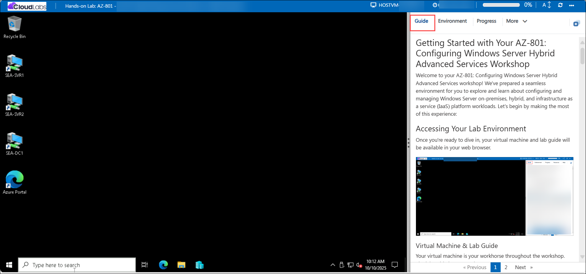

### Virtual Machine & Lab Guide
 
Your virtual machine is your workhorse throughout the workshop. The lab guide is your roadmap to success.
 
## Exploring Your Lab Resources
 
To better understand your lab resources and credentials, navigate to the **Environment** tab.
 
  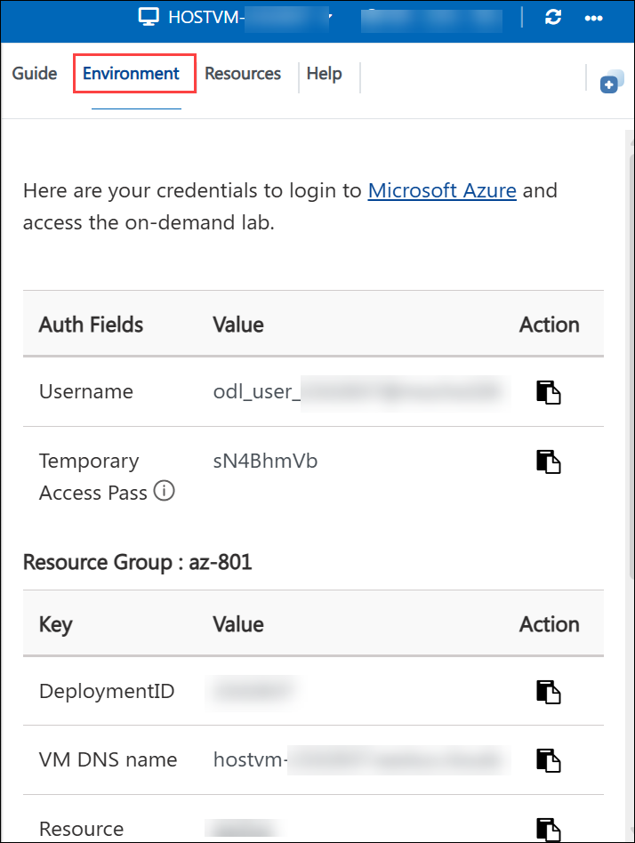
 
## Utilizing the Split Window Feature
 
For convenience, you can open the lab guide in a separate window by selecting the **Split Window** button from the Top right corner.
 
   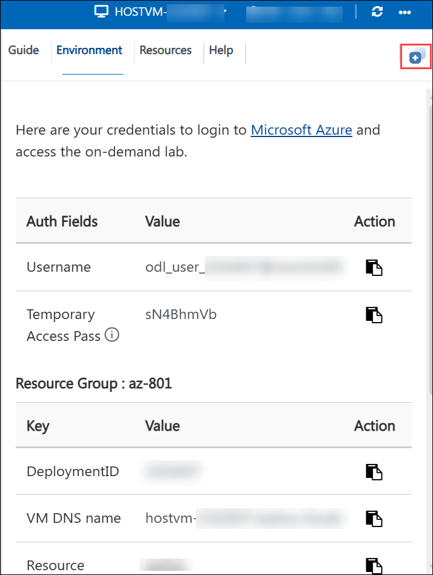
 
## Managing Your Virtual Machine
 
1. Feel free to start, stop, or restart your virtual machine as needed from the **Resources** tab. Your experience is in your hands!
 
   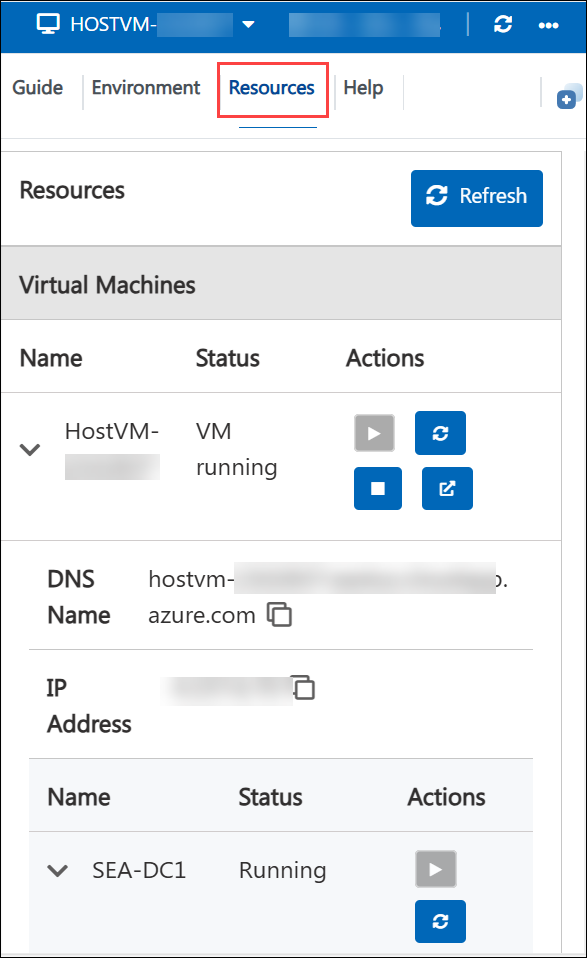

1. To initiate the required VMs, use the dropdown menu located at the top of the lab environment

      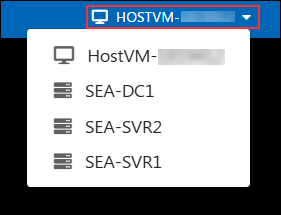
 
1. When logging into the Hyper-V virtual machines, if a message appears stating **"Press Ctrl+Alt+Delete to unlock"**, navigate to the **Actions** menu in the Virtual Machine Connection window and select the **Ctrl+Alt+Delete** option, as shown in the image below.

    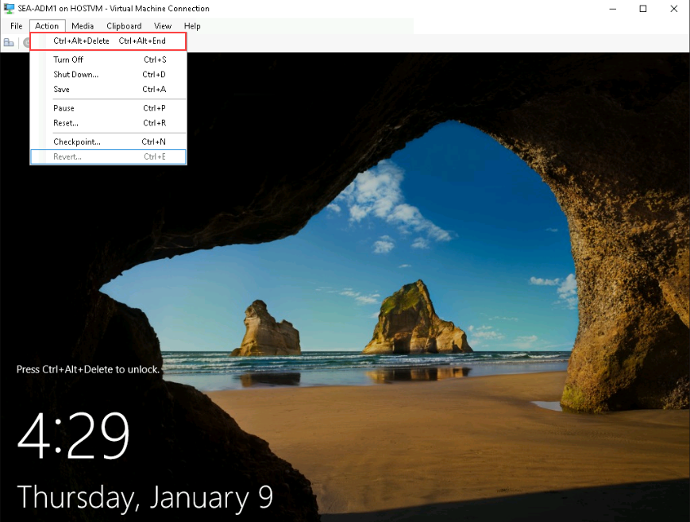

1. If you face an issue while copying the content from the lab guide and pasting it into the Hyper-V virtual machines, navigate to the **Clipboard** option in the Virtual Machine Connection window and select **Type Clipboard Text**.

    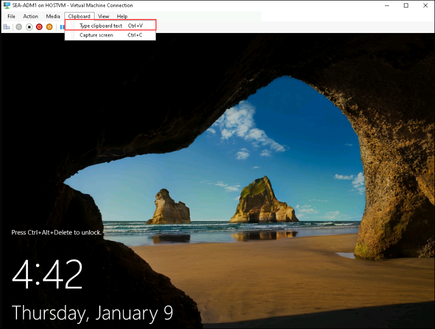  

## Lab Guide Zoom In/Zoom Out
 
1. To adjust the zoom level for the environment page, click the **A↕** icon **(1)** next to the timer, and then select the desired zoom percentage **(2)** from the list.

   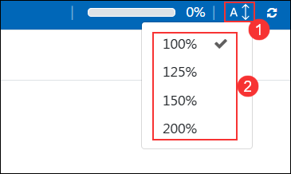
 
## Lab Duration Extension

1. To extend the duration of the lab, kindly click the **Hourglass** icon in the top right corner of the lab environment. 

    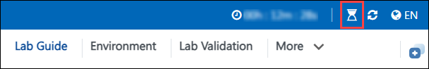

    >**Note:** You will get the **Hourglass** icon when 10 minutes are remaining in the lab.

1. Click **OK** to extend your lab duration.
 
   

1. If you have not extended the duration before when the lab is about to end, a pop-up will appear, giving you the option to extend. Click **OK** to proceed.

## Pasting Commands in the PowerShell/CloudShell Environment

Please make sure to use the **Shift+Insert** or **CTRL+SHIFT+V** or **CTRL+V** keys when pasting commands inside the PowerShell/CloudShell environment instead of right-clicking

## Let's Get Started with Azure Portal
 
1. On your virtual machine, click on the Azure Portal icon as shown below:
 
   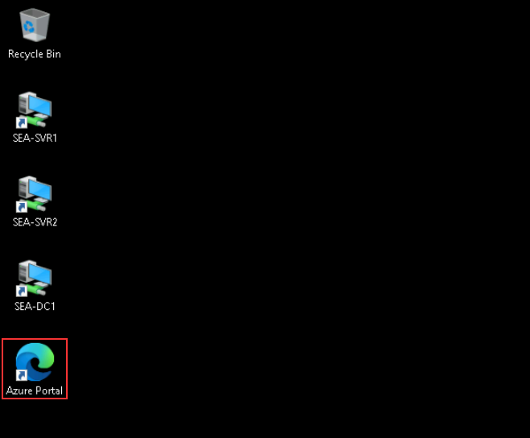

 
1. You'll see the **Sign into Microsoft Azure** tab. Here, enter your credentials:
 
   - **Email/Username:** <inject key="AzureAdUserEmail"></inject>
 
     
 
1. Next, provide your password:
 
   - **Password:** <inject key="AzureAdUserPassword"></inject>
 
      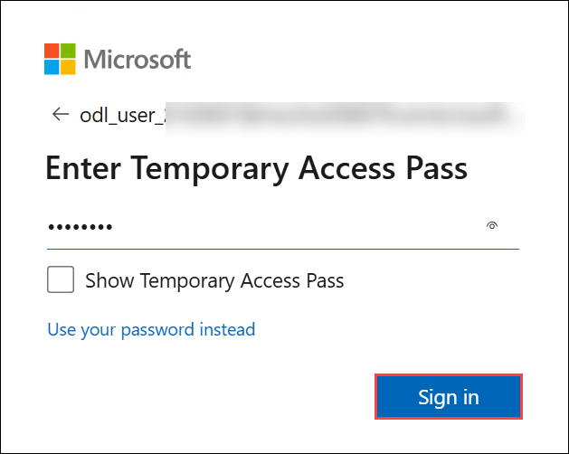

1. On the **Stay Signed in?** pop, click **Yes**.

   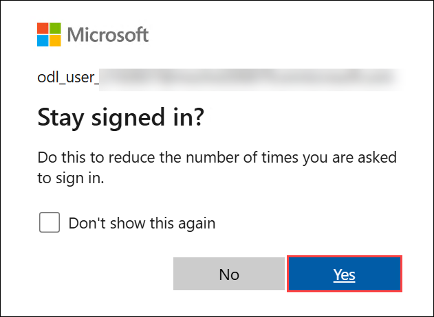

## Support Contact
 
The CloudLabs support team is available 24/7, 365 days a year, via email and live chat to ensure seamless assistance at any time. We offer dedicated support channels tailored specifically for both learners and instructors, ensuring that all your needs are promptly and efficiently addressed.
 
Learner Support Contacts:
 
- Email Support: cloudlabs-support@spektrasystems.com
- Live Chat Support: https://cloudlabs.ai/labs-support

Click **Next** from the bottom right corner to embark on your Lab journey!
 
   .png)
 
Now you're all set to explore the powerful world of technology. Feel free to reach out if you have any questions along the way. Enjoy your workshop!
