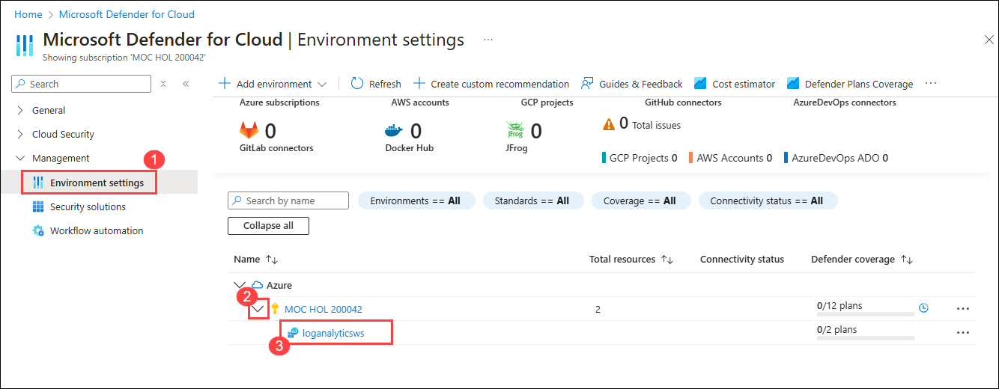

# Lab 02: Implementing Security Solutions in Hybrid Scenarios 

**Note:** An **[interactive lab simulation](https://mslabs.cloudguides.com/guides/AZ-801%20Lab%20Simulation%20-%20Implementing%20security%20solutions%20in%20hybrid%20scenarios)** is available that allows you to click through this lab at your own pace. You may find slight differences between the interactive simulation and the hosted lab, but the core concepts and ideas being demonstrated are the same. 

## Lab objectives

After completing this lab, you'll be able to:

- Create an Azure Log Analytics workspace and an Azure Automation account
- Configure Microsoft Defender for Cloud
- Provision Azure VMs running Windows Server.
- Onboard on-premises Windows Server into Defender for Cloud and Azure Automation.
- Verify the hybrid capabilities of Defender for Cloud and Azure Automation solutions.

## Estimated timing: 80 minutes

## Architecture diagram

## Exercise 1: Creating an Azure Log Analytics workspace

#### Task 1: Create an Azure Log Analytics workspace 

1. Connect to **SEA-SVR2**, and then, if needed, sign in with the credentials provided by the instructor.
1. On **SEA-SVR2**, start Microsoft Edge, go to the Azure portal at `https://portal.azure.com/`, and sign in by using the credentials of a user account with the Owner role in the subscription you'll be using in this lab.
1. On **SEA-SVR2**, in the Azure portal, in the **Search resources, services, and docs** text box, on the toolbar, search for and select **Log Analytics workspaces**, and then, on the **Log Analytics workspaces** page, select **+ Create**.
1. On the **Basics** tab of the **Create Log Analytics workspace** tab, enter the following settings, select **Review + Create**, and then select **Create**:

   | Settings | Value |
   | --- | --- |
   | Subscription | the name of the Azure subscription you are using in this lab |
   | Resource group | the name of a new resource group **AZ801-L0201-RG** |
   | Log Analytics Workspace | any unique name |
   | Region | choose a region near you |

        

        

   >**Note**: Wait for the deployment to complete. The deployment should take about 1 minute.

> **Congratulations** on completing the task! Now, it's time to validate it. Here are the steps:
> - Hit the Validate button for the corresponding task. If you receive a success message, you can proceed to the next task. 
> - If not, carefully read the error message and retry the step, following the instructions in the lab guide.
> - If you need any assistance, please contact us at labs-support@spektrasystems.com. We are available 24/7 to help.
 
<validation step="d9cb7f98-600a-41b6-aceb-0f861cb042e1" />

## Exercise 2: Configuring Microsoft Defender for Cloud

#### Task 1: Enable Defender for Cloud and automatic agent installation

1. On **SEA-SVR2**, in the Azure portal, in the **Search resources, services, and docs** text box, on the toolbar, search for and select **Microsoft Defender for Cloud**.

1. On the **Microsoft Defender for Cloud \| Overview** page, if you see any pop-up regarding **Enhance your security posture by enabling Defender CSPM**, select **No thanks**

     

1. On the **Microsoft Defender for Cloud \| Overview** page, select the  **Click here to upgrade >** link. In the **Getting started** page, select **Upgrade**.

   >**Note:** Your subscription may already have the enhanced security of Defender for Cloud enabled, in which case there is no need to upgrade, and you can continue on to the next task.

#### Task 2: Enable enhanced security of Defender for Cloud

1. On **SEA-SVR2**, in the Microsoft Edge window displaying the Azure portal, on the **Microsoft Defender for Cloud | Overview** page, in the **Management** section of the vertical menu on the left, select **Environment settings**.

1. On the **Environment settings** page, select the entry representing your Azure subscription.

    

1. On the **Settings \| Defender plans** page, select **Enable all plans**. In the **Plan selection** page, select **Microsoft Defender for APIs Plan 1**, and then select **Save**.

    

1. In the **Settings | Defender plans** page, select **Save**.

    

   >**Note:**  You may encounter notifications about auto-provisioning update failures. You can safely ignore these notifications as you will only use the Servers plan in this lab. Note that you can selectively disable individual Microsoft Defender plans listed on the same page.

1. Set all of the plans to **Off** except for the **Servers** and select **Save**. Confirm when asked if you are sure you want to downgrade.

    >**Note:**  When presented with the resource types selection for the Databases plan, toggle each entry to Off and then select Continue. For the purpose of this lab, you can safely ignore any notications about individual database resources failing to save.

     

     

1. Select the **Settings & monitoring** tab, and in the list of extensions, set **Guest Configuration agent (preview)** to **On**.

     

1. On the **Settings & monitoring** tab, in the list of extensions, set **Vulnerability assessment for machines** to **On**, and select the **Edit configuration** link.

1. On the **Extension deployment configuration** page, ensure that the **Microsoft Defender vulnerability management** option is selected, and then select **Apply**.

    

1. On the **Settings & monitoring** page, select **Continue**.  

    
 
1. On the **Defender plan** page, select **Save** and then close the page.

    

1. Browse back to the **Microsoft Defender for Cloud | Overview** page, and then, in the **Management** section of the vertical menu on the left, select **Environment settings**.
1. On the **Environment settings** page, expand the entry representing your **Azure subscription** and select the entry representing the **Log Analytics workspace** you created in the previous exercise.

    

1. On the **Settings \| Defender plans** page, enable the **Servers** Defender plan, and then select **Save**.

    

   >**Note:**  To enable all Defender for Cloud features including threat protection capabilities, you must enable enhanced security features on the subscription containing the applicable workloads. Enabling it at the workspace level doesn't enable just-in-time VM access, adaptive application controls, and network detections for Azure resources. In addition, the only Microsoft Defender plans available at the workspace level are Microsoft Defender for servers and Microsoft Defender for SQL servers on machines.

1. On the **Settings \| Defender plans** page, in the vertical menu on the left side, in the **Settings** section, select **Data collection**.

    

1. On the **Settings \| Data collection**, select **All Events**, and then select **Save**.

   >**Note:**  Selecting a data collection tier in Defender for Cloud only affects the storage of security events in your Log Analytics workspace. The Log Analytics agent will still collect and analyze the security events required for Defender for Cloud's threat protection, regardless of the level of security events you choose to store in your workspace. Choosing to store security events enables investigation, search, and auditing of those events in your workspace.

## Exercise 3: Provisioning Azure VMs running Windows Server

### Task 1: Deploy an Azure VM by using an Azure Resource Manager template

1. In the **Search resources, services, and docs text box**, on the toolbar, search for and select **Deploy a custom template**.

1. In the **Custom deployment** page, select **Build your own template in the editor**.

1. On the **Edit template** page, select **Load file**, upload the template file **L02-rg_template.json** and then select **Save**.

1. On the **Custom deployment** page, specify the following settings, and leave the other settings with their default values:

   |Setting|Value|
   |---|---|
   |Subscription|Leave the default value|
   |Resource group| Select **AZ801-L0202-RG**|
   |Region|Leave the default region|
   |Admin Username| Admin name of your choosing |
   |Admin Password|Select a strong password of your choosing |

1. Select **Review + create**, and then select **Create**.

   >**Note**: The deployment might take about 3 minutes.

1. Verify that the deployment completed successfully.

> **Congratulations** on completing the task! Now, it's time to validate it. Here are the steps:
> - Hit the Validate button for the corresponding task. If you receive a success message, you can proceed to the next task. 
> - If not, carefully read the error message and retry the step, following the instructions in the lab guide.
> - If you need any assistance, please contact us at labs-support@spektrasystems.com. We are available 24/7 to help.
 
<validation step="c2a22c14-f2af-46cb-876c-19157953d41d" />

## Exercise 4: Onboarding on-premises Windows Server into Microsoft Defender for Cloud and Azure Update Manager

#### Task 1: Install Azure Arc agents on an On-Premises Server

1. On **SEA-SVR2**, in the Microsoft Edge window displaying the Azure portal, type **Arc**, then select **Azure Arc**.

    

1. In the navigation pane under **Azure Arc resources**, select **Machines**.

    

1. Select **+ Add/Create**, and in the dropdown, select **Add a machine**. 

1. Select **Generate script** from the **Add a single server** section. 

    

1. In the **Add a server with Azure Arc** page, under **Project details**, select the Resource group you created earlier (AZ801-L0201-RG). 

1. Under **Server details**, select **(US) East** as the region. 

1. Review the SQL Server and Connectivity options. Leave the default values and select **Next**. 

    

1. In the **Tags** tab, review the default available tags and Select **Next**. 

    

1. In the **Add a server with Azure Arc** tab, scroll down and select the **Download** button.

    

   >Hint: if your browser blocks the download, allow it in the Microsoft Edge browser; select the ellipsis button (…), and then select Keep.

1. Right-click the **Windows Start** button and select **Windows PowerShell (Admin)**

   > For *Username*, enter **Administrator** and for *Password* enter Passw0rd!, if you get a UAC prompt.

1. Type **cd C:\Users\Administrator.contoso\Downloads** or navigate to the folder where you downloaded the script. 
 
1. Type `Set-ExecutionPolicy -ExecutionPolicy Unrestricted` and press **Enter**. 

1. Enter **A** for **Yes to All** and press **Enter**.

1. Type `.\OnboardingScript.ps1` and press **Enter**. 

1. Enter **R** to **Run once** and press **Enter** (this may take a couple minutes).

   >The setup process opens a new Microsoft Edge browser tab to authenticate the Azure Arc agent. Select your admin account, wait for the message Authentication complete. Return to Windows PowerShell and wait for the installation to complete before closing the window.

1. Return to the Azure portal page where you downloaded the script and select **Close**.

1. Close the **Add servers with Azure Arc** page and navigate back to the **Azure Arc Machines** page.

1.	Select **Refresh** until the **SEA-SVR2** server name appears and the Status is **Connected** in the Arc console. 

    

> **Congratulations** on completing the task! Now, it's time to validate it. Here are the steps:
> - Hit the Validate button for the corresponding task. If you receive a success message, you can proceed to the next task. 
> - If not, carefully read the error message and retry the step, following the instructions in the lab guide.
> - If you need any assistance, please contact us at labs-support@spektrasystems.com. We are available 24/7 to help.
 
<validation step="eb2bf593-0882-4b92-9754-57446064f992" />

### Task 2: Enable Change Tracking and Inventory on the Arc machine

1. In the navigation pane under **Azure Arc- Machines- SEA-SVR2**, under **Operations** select **Inventory**.   

    

1. On the **Change Tracking and Inventory** page, click **Enable**.

   >Notice that the Log Analytics workspace you created is listed under **Enable change tracking and inventory feature with AMA**.

1. Wait for the deployment of the Change Tracking feature to complete. This may take up to 5 minutes so proceed to the next steps.

### Task 3: Enable Monitoring using Insights

1. Navigate to the **SEA-SVR2** Azure Arc machine and under **Settings**, select **Extensions**.  

    

   >**Note:** You can view the addition of the ChangeTracking and Azure Monitor Agent extensions.

1. Under **Monitoring** select **Insights**, and select **Enable**.  

    

1. On the **Monitoring configuration** page under **Data collection rule**, select **Create New**.

    

1. In the **Create new rule** page, enter **Arc** for the **Data collection rule** name.

    
1. Under **Processes and dependencies**, select **Enable processes and dependencies (map)**.
1. Leave the name of the Azure subscription you are using in this lab.
1. From the **Log Analytics workspaces** drop-down menu, select the Log analytic workspace that you created earlier.
1. Select **Create**, then **Configure**.

    

   >**Note**: This deployment may take some time. Continue with other tasks and you can return to this later.

### Task 4: Enable Monitoring with Windows Updates 

   On **SEA-SVR2**, Windows Update is disabled by default. Make sure that on the **SEA-SVR2** server Windows Update is NOT disabled. You must enable it before you proceed to the next step.

1. Open the Services console and select the **Windows Update** service.

1. Right-click **Windows Update** and select **Properties** from the context menu. Set the startup type to **Automatic** and start the service. 

    

1. Close the Services console.

1. In the Azure Portal search bar, type **Azure Update Manager**.

1. In the navigation pane, under **Resources**, select **Machines**. You should see **SEA-SVR2** Azure Arc-enabled server listed on the **Machines** page. Select the **SEA-SVR2** machine.

    

1. In the **Recommended updates** tab, under **Periodic assessment**, click **Enable now**.

1. From the drop down menu for the **SEA-SVR2** Arc-enabled server, under **Periodic assessment**, select **Enable**, and then **Save**. 

    

1. On the **Updates** page, select **Check for updates**. 

1.	On the **Trigger assess now** window, select **OK**.

    

   >**Note:** The missing updates will appear in a few minutes. You can revisit the Azure Arc machine periodically and you should see the updates reflected shortly after.

### Task 5: Verify Azure Policy compliance, change tracking, Inventory, Insights monitoring, and Azure Updates

1.	Navigate to the **SEA-SVR2** Azure Arc machine, and in the navigation pane under **Monitoring**, select **Insights**.

1.	Select **Analyze data**. You should be able to see the performance data.  

    

1.	Select the **Map** tab and view the dependency map.  

    

   >**Note**: If you don’t see any data, return to the **Performance** tab and refresh. Then refresh the **Map** section. You should see the data and process dependency information for **SEA-SVR2**.

1.	In the navigation pane, under **Operations**, select **Inventory** to view the inventory data.   

    

1.	Select **Change Tracking** to view the data that was changed.  

    

### Review

In this lab, you have completed:

- Created an Azure Log Analytics workspace and an Azure Automation account.
- Configured Defender for Cloud.
- Provisioned Azure VMs running Windows Server.
- Onboarded on-premises Windows Server into Defender for Cloud and Azure Automation.
- Verified the hybrid capabilities of Defender for Cloud and Azure Automation solutions.

### You have successfully completed the lab.
