# Lab 02: Implementing Security Solutions in Hybrid Scenarios 

## Lab Overview

In this hands-on lab, you will implement security solutions in a hybrid environment by integrating on-premises and cloud-based security services. You will create and configure an Azure Log Analytics workspace, enable Microsoft Defender for Cloud, provision Azure virtual machines, onboard on-premises servers to Azure Arc, and configure monitoring and update management.

## Lab Objectives

In this lab, you'll be working on:

- Exercise 1: Creating an Azure Log Analytics workspace
- Exercise 2: Configuring Microsoft Defender for Cloud
- Exercise 3: Provisioning Azure VMs running Windows Server
- Exercise 4: Onboarding on-premises Windows Server into Microsoft Defender for Cloud and Azure Update Manager

## Estimated timing: 80 minutes

## Exercise 1: Creating an Azure Log Analytics workspace

In this exercise, you will create an Azure Log Analytics workspace to collect and analyze security and operational data from your hybrid environment.

### Task 1: Create an Azure Log Analytics workspace 

In this task, you will create a Log Analytics workspace in Azure, which will serve as a central location for monitoring and analyzing data collected from your on-premises and cloud resources.

1. Connect to **SEA-SVR2**, by selecting the **SEA-SVR2** from the top menu drop down.

    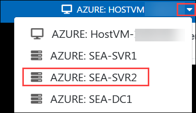

1. If needed, sign in as **CONTOSO\\Administrator** with the password **Pa55w.rd**.

    

1. On **SEA-SVR2**, click on **Azure Portal** shortcut to go to the Azure portal, and sign in by using the credentials of a user account with the Owner role in the subscription you'll be using in this lab.

    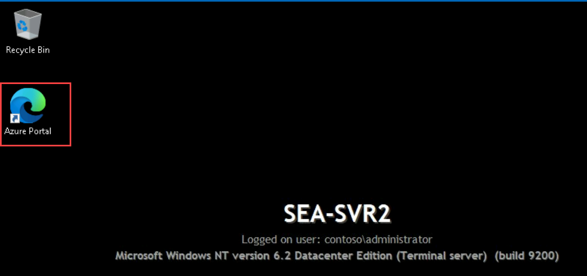

1. On **Sign in to Microsoft Azure** blade, you will see a login screen, in that enter the following email/username and then click on **Next**. 
   
   * Email/Username: <inject key="AzureAdUserEmail"></inject>

1. Now enter the following password and click on **Sign in**.
   
   * Password: <inject key="AzureAdUserPassword"></inject>

     >**Note**: If prompted for MFA, please refer to the steps provided on the Getting Started page.

1. On **SEA-SVR2**, in the Azure portal, in the **Search resources, services, and docs** text box, on the toolbar, search for and select **Log Analytics workspaces(1)**.

      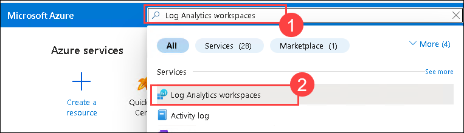 

1. Then, on the **Log Analytics workspaces** page, select **+ Create**.      

        

1. On the **Basics** tab of the **Create Log Analytics workspace** tab, enter the following settings, select **Review + Create (5)**.

   | Settings | Value |
   | --- | --- |
   | Subscription | Leave the default value (1) |
   | Resource group | select **AZ801-L0201-RG (2)** from the drop-down list |
   | Log Analytics Workspace | **loganalytics<inject key="DeploymentID" enableCopy="false"/> (3)** |
   | Region | **<inject key="Resource group Region"></inject> (4)** |

      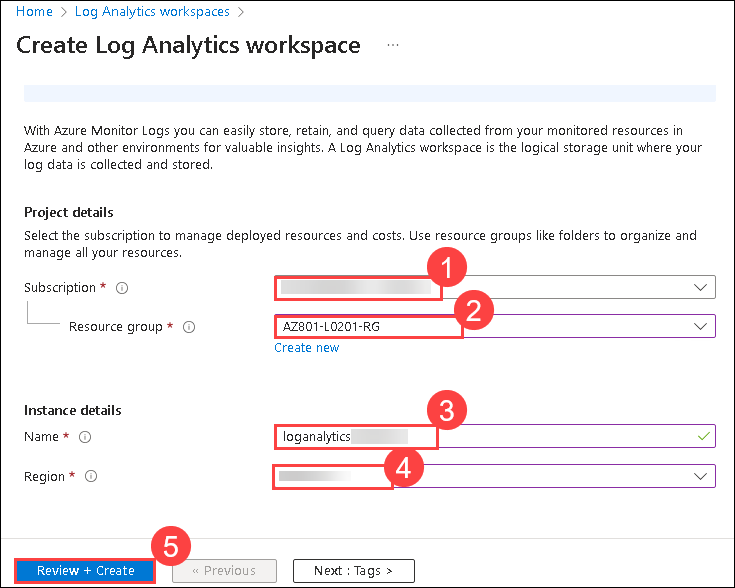  

1. Then select **Create**:      

      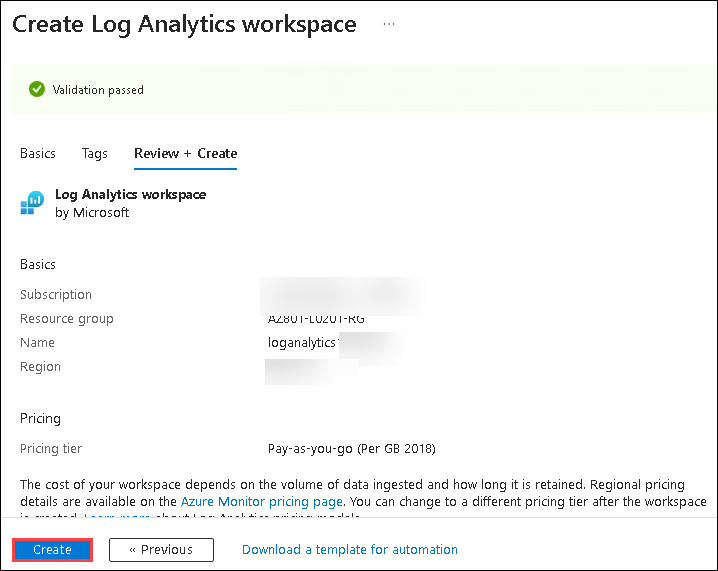  

   >**Note**: Wait for the deployment to complete. The deployment should take about 1 minute.

  > **Congratulations** on completing the Task! Now, it's time to validate it. Here are the steps:
  > - Hit the Validate button for the corresponding task. If you receive a success message, you have successfully validated the lab. 
  > - If not, carefully read the error message and retry the step, following the instructions in the lab guide.
  > - If you need any assistance, please contact us at cloudlabs-support@spektrasystems.com.com.
   <validation step="d9cb7f98-600a-41b6-aceb-0f861cb042e1" />

## Exercise 2: Configuring Microsoft Defender for Cloud

In this exercise, you will enable Microsoft Defender for Cloud to enhance the security posture of your hybrid environment. You will configure Defender plans, enable automatic agent installation, and set up security data collection.

### Task 1: Enable enhanced security of Defender for Cloud

In this task, you will configure enhanced security settings for Microsoft Defender for Cloud, enabling specific Defender plans and monitoring features to protect your environment.

1. On **SEA-SVR2**, in the Azure portal, in the **Search resources, services, and docs** text box, on the toolbar, search for **Microsoft Defender for Cloud (1)** and select **Microsoft Defender for Cloud (2)**.

   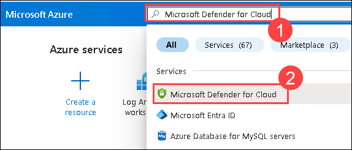

1. If prompted, on the **Microsoft Defender for Cloud \| Overview** page, if you see any pop-up regarding **Enhance your security posture by enabling Defender CSPM**, select **No thanks**

   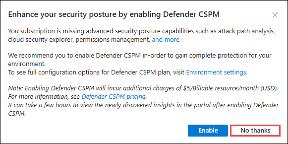  

1. On **SEA-SVR2**, in the Microsoft Edge window displaying the Azure portal, on the **Microsoft Defender for Cloud | Overview** page, in the **Management (1)** section of the vertical menu on the left, select **Environment settings (2)**.

1. On the **Environment settings** page, select the entry representing your **Azure subscription (3)**.

   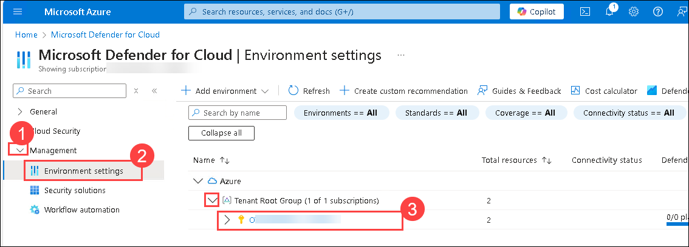 

1. On the **Settings \| Defender plans (1)** page, select **Enable all plans (2)**. In the **Plan selection** page, select **Microsoft Defender for APIs Plan 1 (3)**, and then select **Save (4)**.

   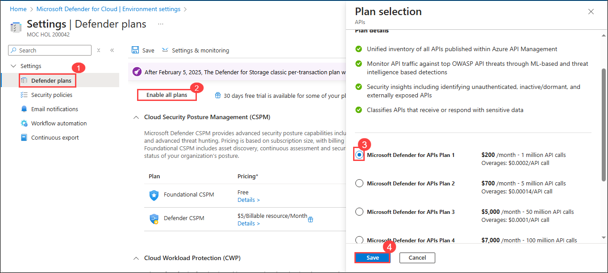 

1. In the **Settings | Defender plans** page, select **Save**.

   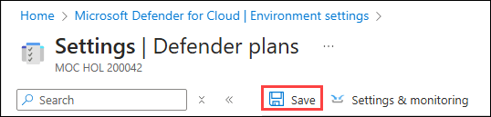 

   >**Note:**  You may encounter notifications about auto-provisioning update failures. You can safely ignore these notifications as you will only use the Servers plan in this lab. Note that you can selectively disable individual Microsoft Defender plans listed on the same page.

1. Set all of the plans to **Off (2)** except for the **Servers (1)** and select **Save (3)**. 

    >**Note:**  When presented with the **Resource types selection** for the Databases plan, toggle each entry to **Off** and then select **Continue**. For the purpose of this lab, you can safely ignore any notications about individual database resources failing to save.

    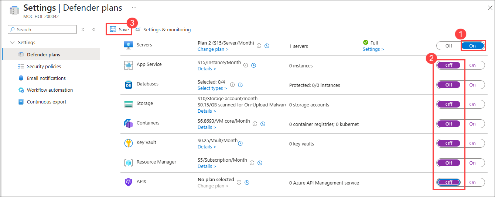 

1. Select **Confirm** when asked if you are sure you want to **downgrade**.    

    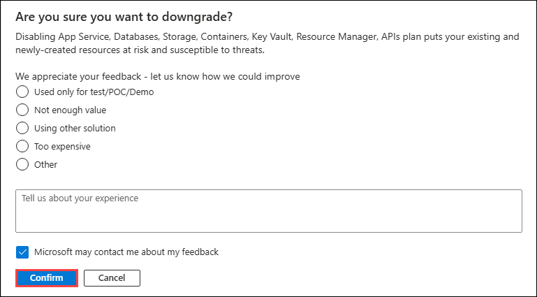 

1. Navigate to **Settings & monitoring** tab from the top menu.

    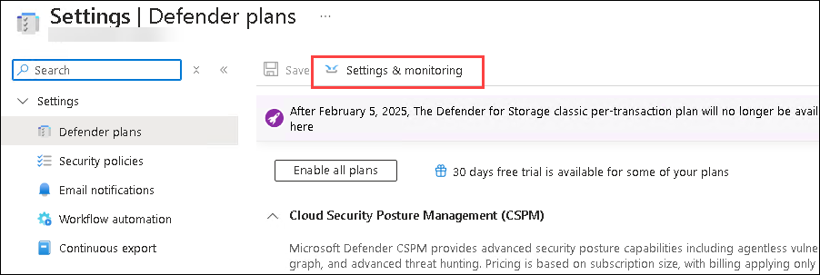 

1. On the **Settings & monitoring** tab, in the list of extensions, set **Vulnerability assessment for machines** to **On**.

    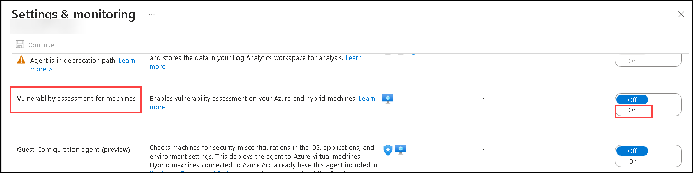 

1. On the **Extension deployment configuration** page, select **Apply**.

    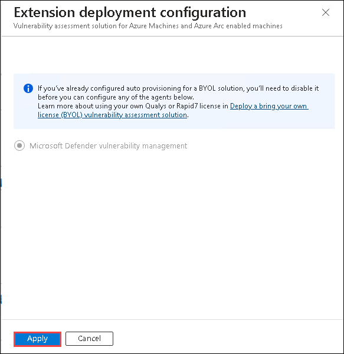 

1. Select the **Edit configuration** link.

    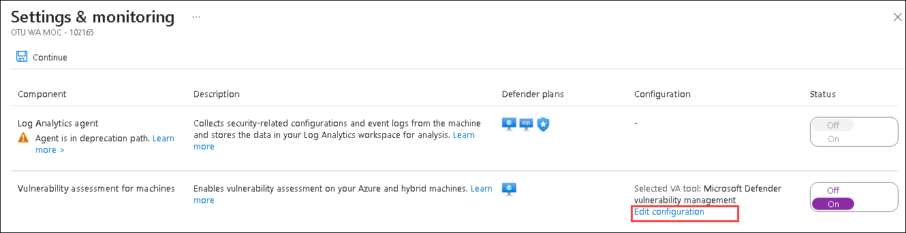

1. On the **Extension deployment configuration** page, ensure that the **Microsoft Defender vulnerability management (1)** option is selected, and then select **Apply (2)**.

   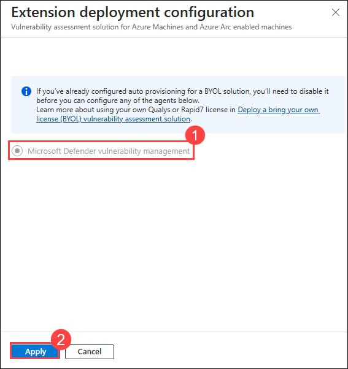    

1. On the **Settings & monitoring** tab, and in the list of extensions, set **Guest Configuration agent (preview)** to **On**.

    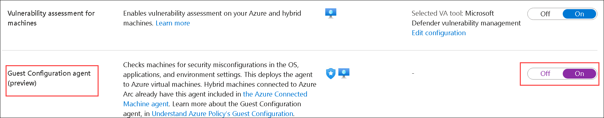 

1. On the **Settings & monitoring** page, select **Continue**.  

   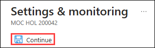 
 
1. On the **Defender plan** page, select **Save** and then close the page.

    

1. Browse back to the **Microsoft Defender for Cloud | Overview** page by clicking on **Microsoft Defender for Cloud**.

    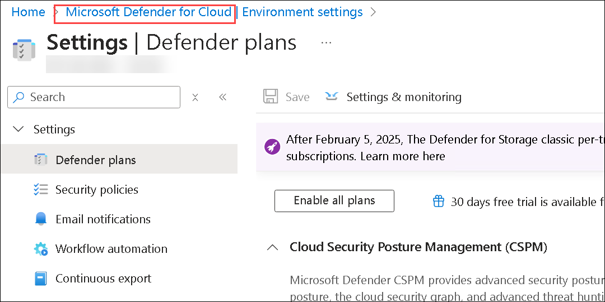 

1. Then, in the **Management** section of the vertical menu on the left, select **Environment settings (1)**.

1. On the **Environment settings** page, expand the entry representing your **Azure subscription (2)** and select the entry representing the **Log Analytics workspace (3)** you created in the previous exercise.

    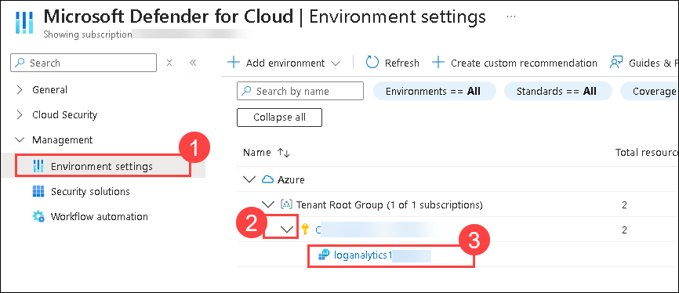

1. On the **Settings \| Defender plans** page, enable the **Servers (1)** Defender plan, and then select **Save (2)**.

    

   >**Note:**  To enable all Defender for Cloud features including threat protection capabilities, you must enable enhanced security features on the subscription containing the applicable workloads. Enabling it at the workspace level doesn't enable just-in-time VM access, adaptive application controls, and network detections for Azure resources. In addition, the only Microsoft Defender plans available at the workspace level are Microsoft Defender for servers and Microsoft Defender for SQL servers on machines.

1. On the **Settings \| Defender plans** page, in the vertical menu on the left side, in the **Settings** section, select **Data collection (1)** then select **All Events (2)**, and then select **Save (3)**.

   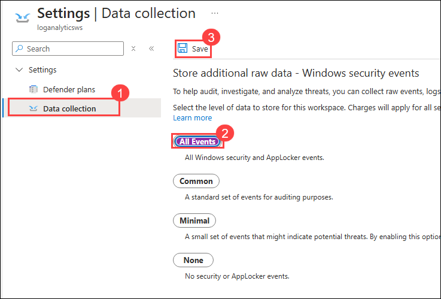 

   >**Note:**  Selecting a data collection tier in Defender for Cloud only affects the storage of security events in your Log Analytics workspace. The Log Analytics agent will still collect and analyze the security events required for Defender for Cloud's threat protection, regardless of the level of security events you choose to store in your workspace. Choosing to store security events enables investigation, search, and auditing of those events in your workspace.

## Exercise 3: Provisioning Azure VMs running Windows Server

In this exercise, you will deploy an Azure virtual machine using an Azure Resource Manager (ARM) template. This virtual machine will be used for monitoring, security analysis, and management.

### Task 1: Deploy an Azure VM by using an Azure Resource Manager template

In this task, you will deploy an Azure virtual machine using an ARM template, specifying necessary parameters such as region, resource group, and credentials.

1. In the **Search resources, services, and docs text box**, on the toolbar, search for **Deploy (1)** and select **Deploy a custom template (2)**.

     

1. In the **Custom deployment** page, select **Build your own template in the editor**.

   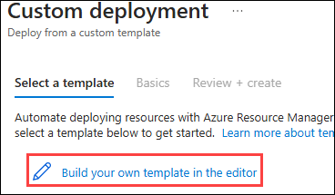 

1. On the **Edit template** page, select **Load file (1)**.

   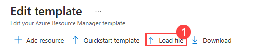 

1. Navigate to `C:\Labfiles\Lab02` **(1)**, upload the template file **L02-rg_template.json (2)** and then click on **Open (3)**.

   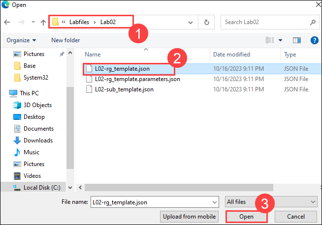 

1. Select **Save**.   

   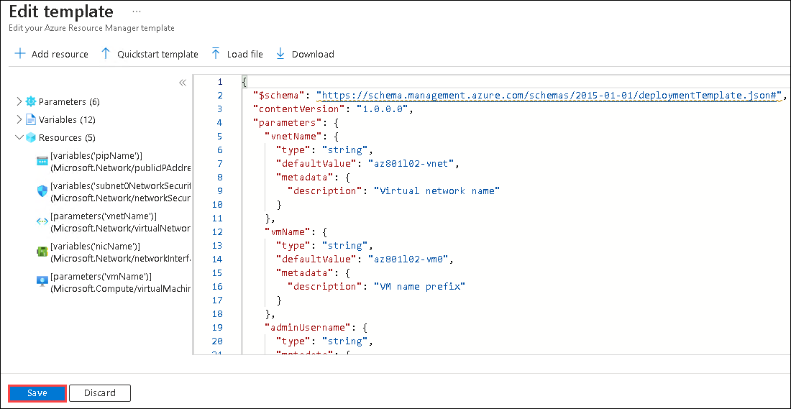 

1. On the **Custom deployment** page, specify the following settings, and leave the other settings with their default values and then click on **Review + create (4)**.

   |Setting|Value|
   |---|---|
   |Subscription|Leave the default value|
   |Resource group| Select **AZ801-L0202-RG (1)** from the dropdown list |
   |Region|Leave the default region **(2)**|
   |Admin Username| Enter **Student (3)** |
   |Admin Password|Enter **Pa55w.rd1234 (4)** |

    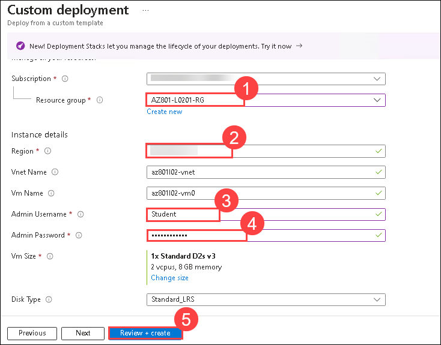   

1. Then select **Create (5)**.

   

    >**Note**: The deployment might take about 3 minutes.

1. Verify that the deployment completed successfully.

  > **Congratulations** on completing the Task! Now, it's time to validate it. Here are the steps:
  > - Hit the Validate button for the corresponding task. If you receive a success message, you have successfully validated the lab. 
  > - If not, carefully read the error message and retry the step, following the instructions in the lab guide.
  > - If you need any assistance, please contact us at cloudlabs-support@spektrasystems.com.
   <validation step="c2a22c14-f2af-46cb-876c-19157953d41d" />

## Exercise 4: Onboarding on-premises Windows Server into Microsoft Defender for Cloud and Azure Update Manager

In this exercise, you will onboard an on-premises Windows Server machine into Azure Arc to enable monitoring, security management, and update management within Azure.

### Task 1: Install Azure Arc agents on an On-Premises Server

In this task, you will install and configure the Azure Arc agent on an on-premises Windows Server, allowing it to be managed within the Azure portal.

1. On **SEA-SVR2**, in the Microsoft Edge window displaying the Azure portal, type **Arc (1)**, then select **Azure Arc (2)**.

   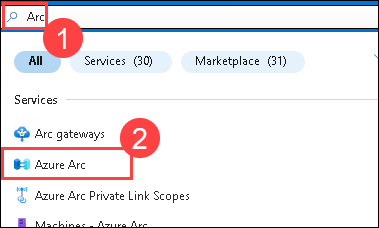 

1. In the navigation pane under **Azure Arc resources**, select **Machines (1)** then select **+ Add/Create (2)**, and in the dropdown, select **Add a machine (3)**

    

1. Select **Generate script** from the **Add a single server** section. 

   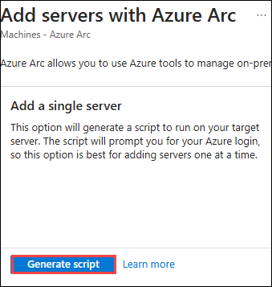 

1. In the **Add a server with Azure Arc** page, under **Project details**, select **AZ801-L0201-RG (1)** resource group. 

   - Under **Server details**, select **<inject key="Resource group Region"></inject> (2)** as the region. 

   - Review the SQL Server and Connectivity options. Leave the default values and select **Next (3)**. 

     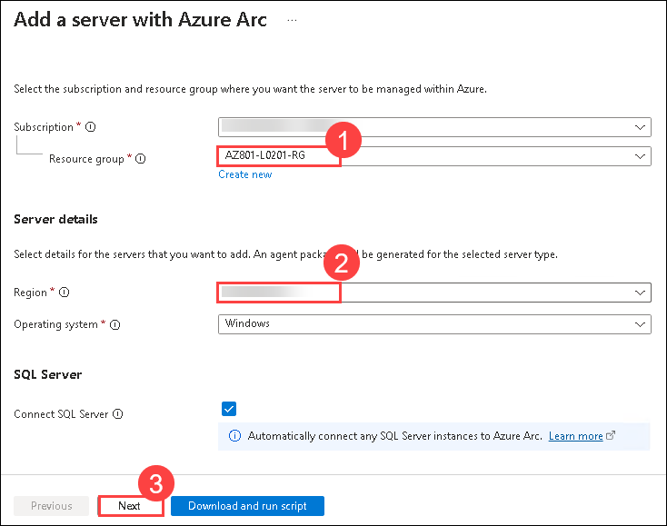 

1. In the **Tags** tab, review the default available tags and Select **Next**. 

    

1. In the **Add a server with Azure Arc** tab, scroll down and select the **Download** button.

   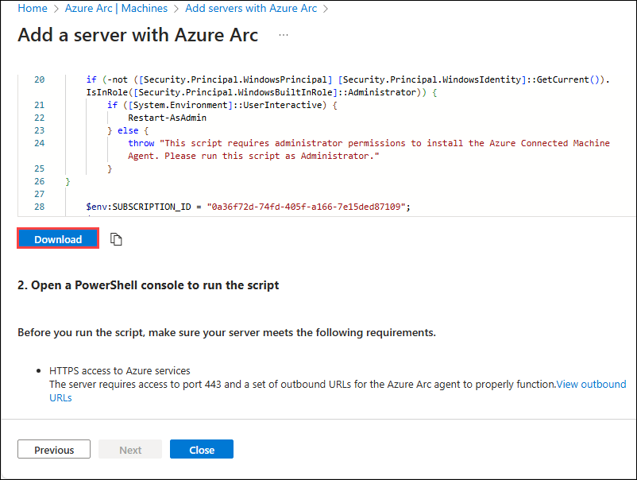 

    >**Note**: If your browser blocks the download, allow it in the Microsoft Edge browser; select the ellipsis button (…), and then select **Keep**.

     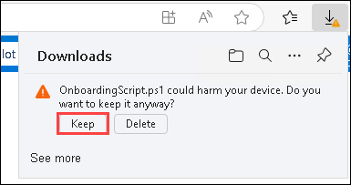    

1. Right-click the **Windows Start (1)** button and select **Windows PowerShell (Admin) (2)**.

   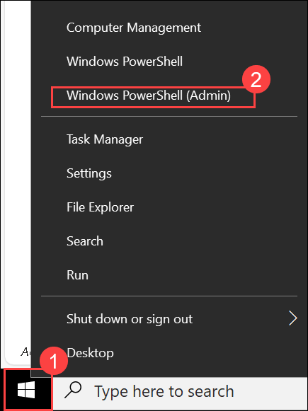

1. Copy and paste the below command into PowerShell and press **Enter**

   ```
    cd C:\Users\Administrator.contoso\Downloads
   ```
 
1. Copy and paste the below command and press **Enter**

   ```
   Set-ExecutionPolicy -ExecutionPolicy Unrestricted 
   ```

1. Enter **A** for **Yes to All** and press **Enter**.

   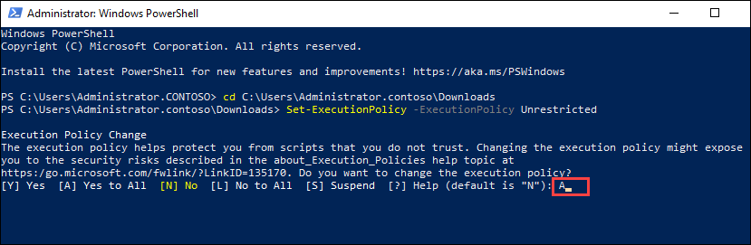

1. Copy and paste the below command and press **Enter**

   ```
   .\OnboardingScript.ps1
   ```

1. Enter **R** to **Run once** and press **Enter** (this may take a couple minutes).

   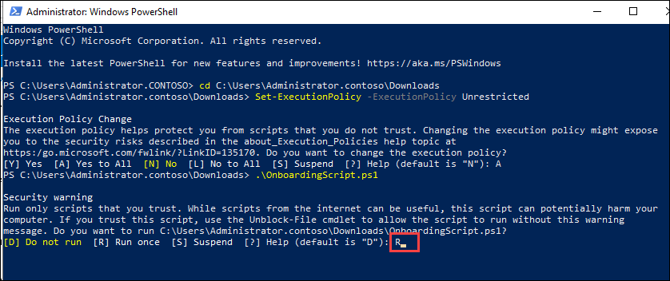

1. The setup process opens a new Microsoft Edge browser tab to authenticate the Azure Arc agent. Select your admin account **<inject key="AzureAdUserEmail"></inject>**.

   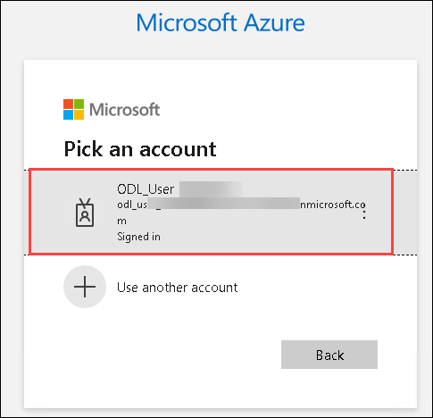

1. Wait for the message Authentication complete.

   

1. Return to **Windows PowerShell** and wait for the installation to complete before closing the window.

   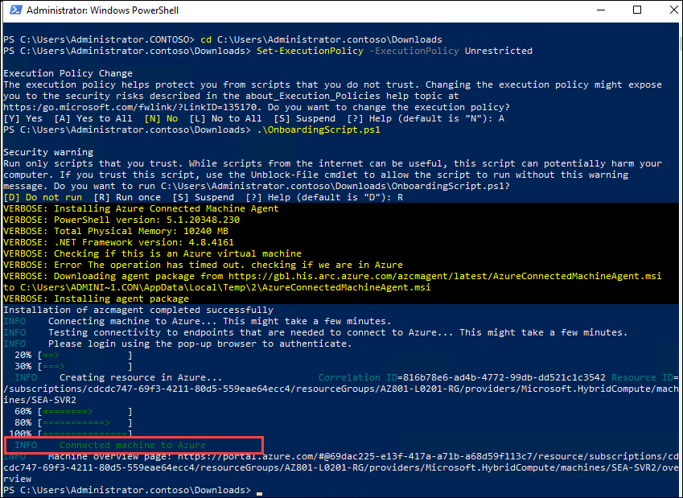

1. Return to the **Azure portal** page where you downloaded the script and select **Close**.

   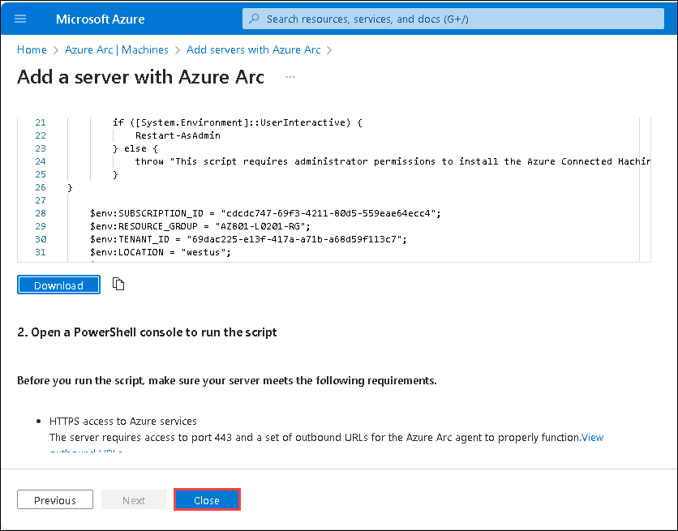

1. **Close** the **Add servers with Azure Arc** page and navigate back to the **Azure Arc Machines** page.

   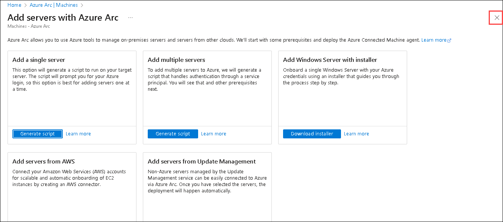

1. Select **Refresh** until the **SEA-SVR2** server name appears and the Status is **Connected** in the Arc console. 

    

  > **Congratulations** on completing the Task! Now, it's time to validate it. Here are the steps:
  > - Hit the Validate button for the corresponding task. If you receive a success message, you have successfully validated the lab. 
  > - If not, carefully read the error message and retry the step, following the instructions in the lab guide.
  > - If you need any assistance, please contact us at cloudlabs-support@spektrasystems.com.
   <validation step="eb2bf593-0882-4b92-9754-57446064f992" />

### Task 2: Enable Change Tracking and Inventory on the Arc machine

In this task, you will enable change tracking and inventory monitoring to ensure that modifications to the system are logged and can be reviewed.

1. Select the **Azure Arc- Machines- SEA-SVR2**.

   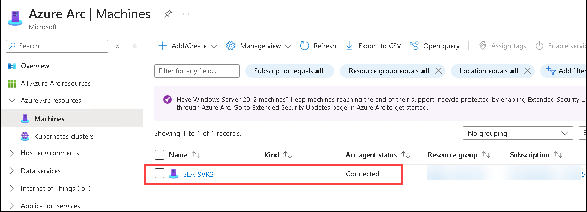

1. In the navigation pane under **Azure Arc- Machines- SEA-SVR2**, under **Operations (1)** select **Inventory (2)**. Notice that the **Log Analytics workspace** **(3)** you created is listed under *Enable change tracking and inventory feature with AMA*. On the **Change Tracking and Inventory** page, click **Enable (4)**.  

   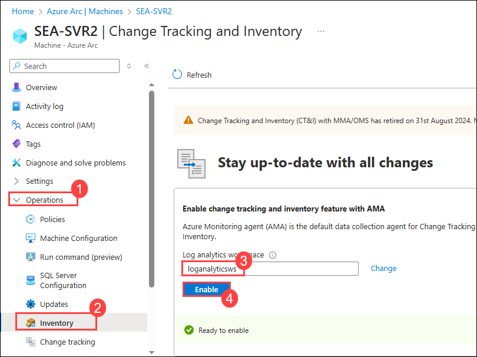 

1. Wait for the deployment of the Change Tracking feature to complete. This may take up to 5 minutes so proceed to the next steps.

### Task 3: Enable Monitoring using Insights

In this task, you will configure Azure Monitor Insights to collect performance and dependency data for the onboarded machine.

1. Navigate to the **SEA-SVR2** Azure Arc machine and under **Settings (1)**, select **Extensions (2)**.  

   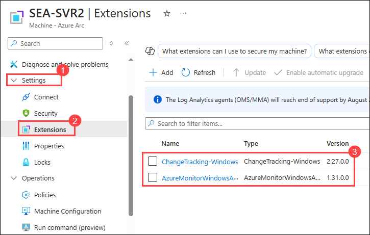 

   >**Note:** **You can view the addition of the ChangeTracking and Azure Monitor Agent extensions (3)**.

1. Under **Monitoring (1)** select **Insights (2)**, and select **Enable (3)**.  

   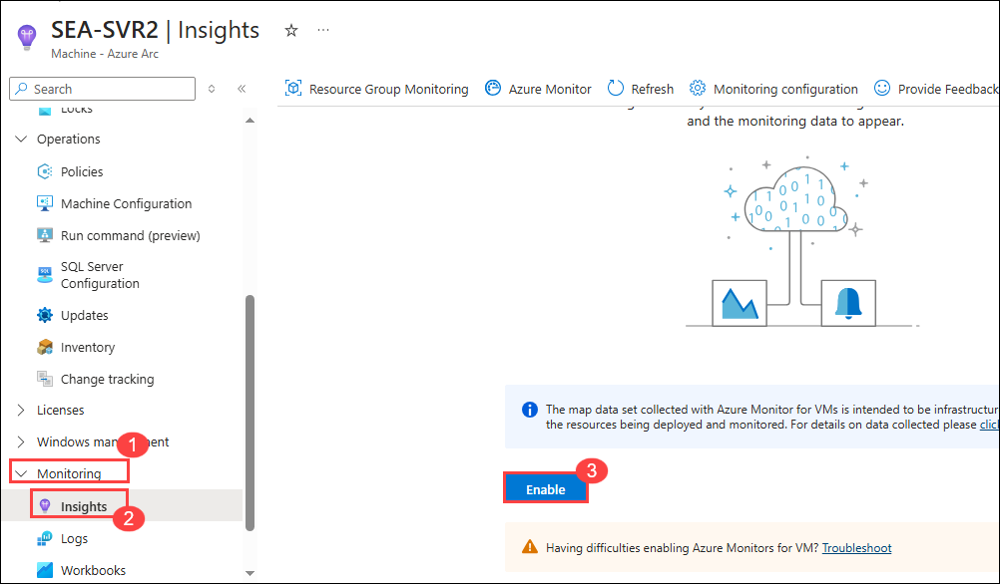 

1. On the **Monitoring configuration** page under **Data collection rule**, select **Create New**.

    

1. In the **Create new rule** page, 

   - Data collection rule name: Enter **Arc (1)**
   - Under **Processes and dependencies**, select **Enable processes and dependencies (map) (2)**
   -  Leave the name of the Azure subscription **(3)** you are using in this lab
   - From the **Log Analytics workspaces (4)** drop-down menu, select the Log analytic workspace that you created earlier.
   - Click on **Create(5)**

      

1. Click on **Configure**.

   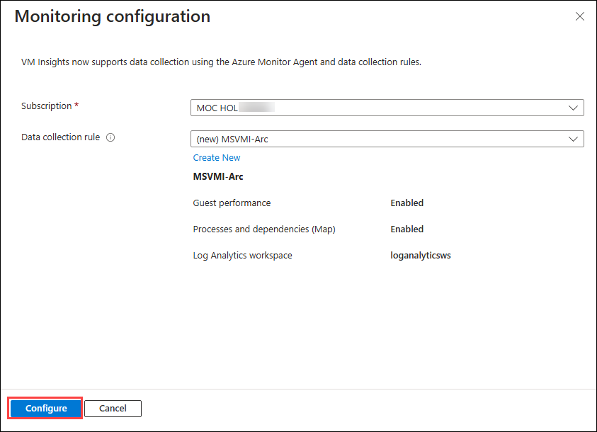 

   >**Note**: This deployment may take some time. Continue with other tasks and you can return to this later.

### Task 4: Enable Monitoring with Windows Updates 

In this task, you will configure update management for the onboarded Windows Server to ensure that it receives necessary security patches and updates.

1. On **SEA-SVR2**, Windows Update is disabled by default. Make sure that on the **SEA-SVR2** server Windows Update is NOT disabled. You must enable it before you proceed to the next step.

1. On the **SEA-SVR2** VM, search for **Services (1)** and select **Services (2)**. 

   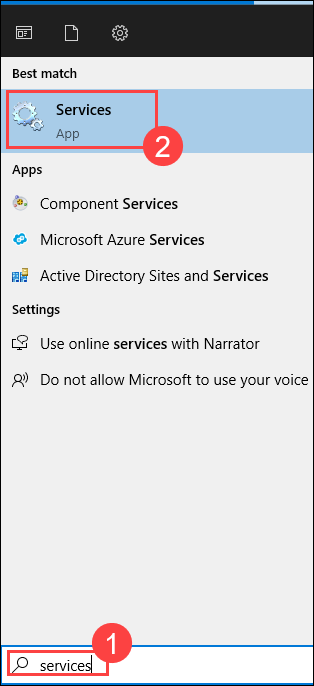 

1. On the Services console and locate the **Windows Update** service.   

1. Right-click **Windows Update** and select **Properties** from the context menu. 

   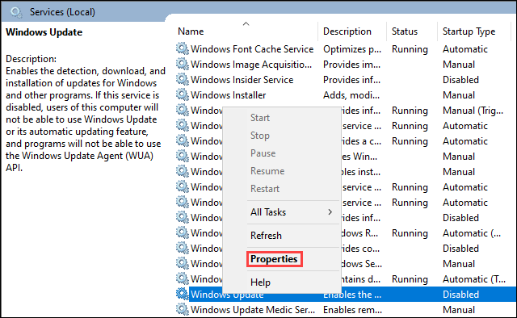 

1. Set the startup type to **Automatic (1)**, then click on **OK (2)** to start the service. 

    

1. Close the Services console.

1. In the Azure Portal search bar, search for **Azure Update Manager (1)** and then select **Azure Update Manager (2)**.

   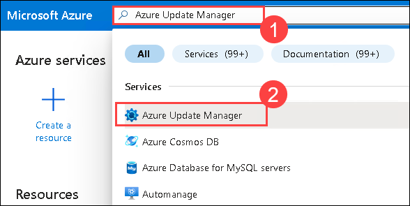

1. In the navigation pane, under Resources, select **Machines (1)**. You should see **SEA-SVR2** Azure Arc-enabled server listed on the Machines page. Select the **SEA-SVR2 (2)** machine.

   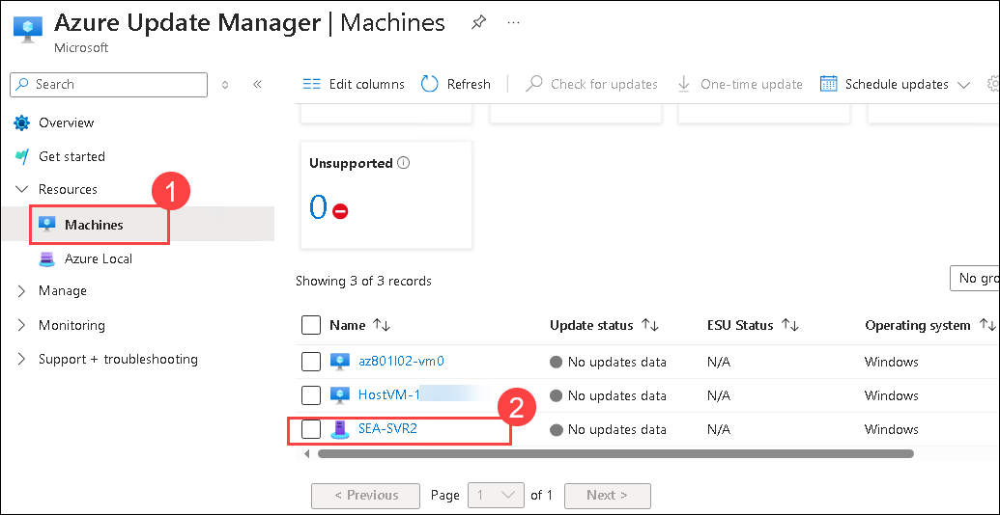

1. It will redirect to the **Operations (1)** > **Updates (2)**. In the **Recommended updates (3)** tab, under **Periodic assessment**, click **Enable now (4)**.

    

1. From the drop down menu for the **SEA-SVR2** Arc-enabled server, under **Periodic assessment**, select **Enable (1)**, and then **Save (2)**. 

   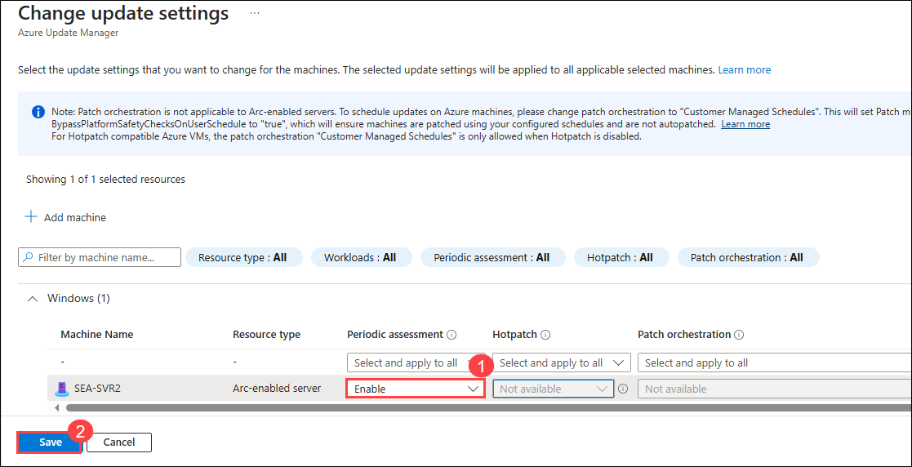 

1. On the **Updates** page, select **Check for updates (1)**. On the **Trigger assess now** window, select **OK (2)**.

    

   >**Note:** The missing updates will appear in a few minutes. You can revisit the Azure Arc machine periodically and you should see the updates reflected shortly after.

### Task 5: Verify Azure Policy compliance, change tracking, Inventory, Insights monitoring, and Azure Updates

In this task, you will verify the successful configuration of monitoring, compliance policies, and update management by reviewing insights, inventory data, and applied security policies.

1. Navigate to the **SEA-SVR2** Azure Arc machine, and in the navigation pane under **Monitoring**, select **Insights (1)**. Select **Performance data (2)**. You should be able to see the performance data **(3)**.  

     

1. Select the **Map (1)** tab and view the dependency map **(2)**.  

    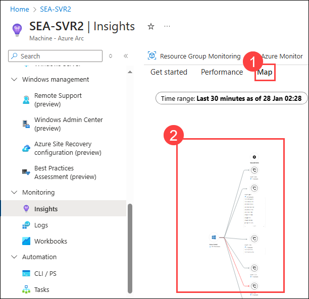 

     >**Note**: If you don’t see any data, return to the **Performance** tab and refresh. Then refresh the **Map** section. You should see the data and process dependency information for **SEA-SVR2**.

1. In the navigation pane, under **Operations**, select **Inventory(1)** to view the inventory data **(2)**.   

    

1. Select **Change Tracking (1)** to view the data that was changed **(2)**.  

    

    >**Note**: This might take around 5-10 mins to show up the data.

### Review

In this lab, you have completed:

- Created an Azure Log Analytics workspace.
- Configured Defender for Cloud.
- Provisioned Azure VMs running Windows Server.
- Onboarded on-premises Windows Server into Defender for Cloud and Azure update manager.

### You have successfully completed the lab.
