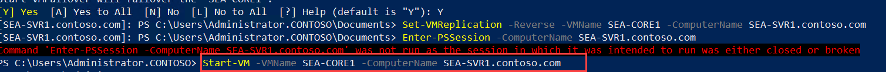
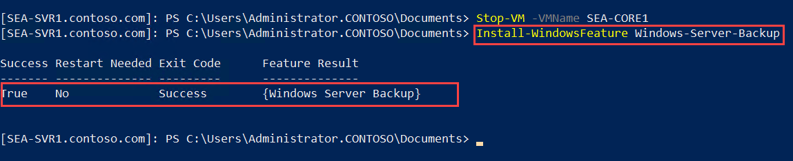

# Lab 04: Implementing Hyper-V Replica and Windows Server Backup

## Lab Overview

In this hands-on lab, you will learn how to implement Hyper-V Replica to replicate virtual machines between two servers for disaster recovery, and Windows Server Backup to back up data to a network share for protection. You will configure replication, test failover, and set up automated backups using PowerShell to ensure data availability and recovery in case of failure.

## Lab Objectives

In this lab, you will be working on:

- Exercise 1: Implementing Hyper-V Replica.
- Exercise 2: Implementing backup and restore with Windows Server Backup.

## Estimated timing: 80 minutes

## Architecture diagram


## Exercise1: Implementing Hyper-V Replica

In this exercise, you will be setting up and configuring Hyper-V Replica to replicate virtual machines between two Hyper-V servers, ensuring high availability and disaster recovery for your virtualized workloads.

### Task 1: Install and configure Hyper-V Replica

In this task, you will be installing and configuring Hyper-V Replica on SEA-SVR2 and SEA-SVR1 to enable the replication of virtual machines between these two servers.

1. Connect to **SEA-SVR2**, by selecting the **SEA-SVR2** from the top menu drop down.

    

1. If needed, sign in as **CONTOSO\\Administrator** with the password **Pa55w.rd**.

    

     >**Note**: If prompted for MFA, please refer to the steps provided on the Getting Started page.    

1. On **SEA-SVR2**, right click on **Start (1)**, and then select **Windows PowerShell (Admin) (2)**.

   

1. To identify the status of the Windows Defender Firewall with Advanced Security **Hyper-V Replica HTTP Listener (TCP-In)** rule on **SEA-SVR2**, at the Windows PowerShell prompt, enter the following command and press Enter:

   ```powershell
   Get-NetFirewallRule -DisplayName 'Hyper-V Replica HTTP Listener (TCP-In)'
   ```

       

1. To enable the Windows Defender Firewall with Advanced Security **Hyper-V Replica HTTP Listener (TCP-In)** rule on **SEA-SVR2**, enter the following command and press Enter:

   ```powershell
   Enable-NetFirewallRule -DisplayName 'Hyper-V Replica HTTP Listener (TCP-In)'
   ```

       

1. To configure **SEA-SVR2** as a Replica server for **Hyper-V Replica**, enter the following commands one by one, and after entering each command, press Enter:

   ```powershell
   New-Item -ItemType Directory -Path C:\ReplicaStorage -Force
   Set-VMReplicationServer -ReplicationEnabled $true -AllowedAuthenticationType Kerberos -KerberosAuthenticationPort 8080 -ReplicationAllowedFromAnyServer $true -DefaultStorageLocation C:\ReplicaStorage
   ```

    

1. To verify that **SEA-SVR2** is configured as a Replica server for **Hyper-V Replica**, enter the following command and press Enter:

   ```powershell
   Get-VMReplicationServer
   ```

       
  
     > **Note**: Verify that the output of the command includes the following settings:

      - **RepEnabled: True**
      - **AuthType: Kerb**
      - **KerAuthPort: 8080**
      - **CertAuthPort: 443**
      - **AllowAnyServer: True**

1. To identify the virtual machines present on **SEA-SVR2**, enter the following command and press Enter:

   ```powershell
   Get-VM
   ```

        

     > **Note**: Verify that the output of the command includes **SEA-CORE1**. 

     > **Note**: Leave the **Administrator: Windows PowerShell** window open.

1. To open another **Administrator: Windows PowerShell** window, on **SEA-SVR2**, right click on **Start** and select **Windows PowerShell (Admin)**.

   

1. To establish a PowerShell Remoting session to **SEA-SVR1**, in the newly opened Windows PowerShell window, enter the following command, and then press Enter:

   ```powershell
   Enter-PSSession -ComputerName SEA-SVR1.contoso.com
   ```

        
 
     > **Note**: You can recognize the PowerShell Remoting session based on the PowerShell prompt that contains, in this case, the **[SEA-SVR1.contoso.com]** prefix.

1. To identify the status of the Windows Defender Firewall with Advanced Security **Hyper-V Replica HTTP Listener (TCP-In)** rule on **SEA-SVR1**, in the Windows PowerShell window hosting the PowerShell Remoting session to **SEA-SVR1**, enter the following command, and press Enter:

   ```powershell
   Get-NetFirewallRule -DisplayName 'Hyper-V Replica HTTP Listener (TCP-In)'
   ```

       

     > **Note**: Review the output and verify that the **Enabled** property is set to **False**. To use **Hyper-V Replica**, you need to enable this firewall rule.

1. To enable the Windows Defender Firewall with Advanced Security **Hyper-V Replica HTTP Listener (TCP-In)** rule on **SEA-SVR1**, in the Windows PowerShell window hosting the PowerShell Remoting session to **SEA-SVR1**, enter the following command and press Enter:

   ```powershell
   Enable-NetFirewallRule -DisplayName 'Hyper-V Replica HTTP Listener (TCP-In)'
   ```

        

1. To configure **SEA-SVR1** as a Replica server for **Hyper-V Replica**, in the Windows PowerShell window hosting the PowerShell Remoting session to **SEA-SVR1**, enter the following commands one by one, and after entering each command, press Enter:

   ```powershell
   New-Item -ItemType Directory -Path C:\ReplicaStorage -Force
   Set-VMReplicationServer -ReplicationEnabled $true -AllowedAuthenticationType Kerberos -ReplicationAllowedFromAnyServer $true -DefaultStorageLocation C:\ReplicaStorage
   ```

       

     > **Note**: Leave the second **Administrator: Windows PowerShell** window open.

### Task 2: Configure Hyper-V replication

In this task, you will be enabling replication for a virtual machine (SEA-CORE1) from SEA-SVR2 to SEA-SVR1 and verifying that replication is functioning correctly.

1. On **SEA-SVR2**, switch to the **Administrator: Windows PowerShell** window displaying the local PowerShell session.
1. To enable replication of the virtual machine **SEA-CORE1** from **SEA-SVR2** to **SEA-SVR1**, on **SEA-SVR2**, at the Windows PowerShell prompt of the local session, enter the following command and press Enter:

   ```powershell
   Enable-VMReplication SEA-CORE1 -ReplicaServerName SEA-SVR1.contoso.com -ReplicaServerPort 80 -AuthenticationType Kerberos -ComputerName SEA-SVR2.contoso.com
   ```

        

1. To start replication of the virtual machine **SEA-CORE1** from **SEA-SVR2** to **SEA-SVR1**, on **SEA-SVR2**, enter the following command and press Enter:

   ```powershell
   Start-VMInitialReplication SEA-CORE1
   ```
1. To identify the status of replication of the virtual machine **SEA-CORE1** from **SEA-SVR2** to **SEA-SVR1** was successfully started, on **SEA-SVR2**, enter the following command and press Enter:

   ```powershell
   Get-VMReplication
   ```

1. In the output of the command, identify the **State** value and verify it is listed as **InitialReplicationInProgress**. 

    

1. Wait for about 5 minutes, rerun the same command, and verify that the **State** value changed to **Replicating**. Wait until this happens before you proceed to the next steps. In addition, ensure that the **Primary server** is listed as **SEA-SVR2** and **ReplicaServer** as **SEA-SVR1**.

    

1. On **SEA-SVR2**, switch to the **Administrator: Windows PowerShell** window displaying the PowerShell Remoting session to **SEA-SVR1**.

1. To verify that a replica of **SEA-CORE1** is present on **SEA-SVR1**, in the Windows PowerShell window hosting the PowerShellRemoting session to **SEA-SVR1**, enter the following command and press Enter:

   ```powershell
   Get-VM
   ```

       

     > **Note**: Ensure that the output of the command lists **SEA-CORE1**.

     > **Note**: Leave both Windows PowerShell sessions open.

### Task 3: Validate a failover

In this task, you will be testing the failover process by performing a failover of SEA-CORE1 from SEA-SVR2 to SEA-SVR1 and ensuring that replication is consistent after the failover.

1. On **SEA-SVR2**, switch to the **Administrator: Windows PowerShell** window displaying the local PowerShell session.
1. To prepare for a failover of the **SEA-CORE1** virtual machine to **SEA-SVR1**, on **SEA-SVR2**, in the Windows PowerShell window hosting the local session, enter the following command and press Enter:

   ```powershell
   Start-VMFailover -Prepare -VMName SEA-CORE1 -ComputerName SEA-SVR2.contoso.com
   ```

       

     >**Note**: When prompted, enter **Y**, and then press Enter. This command prepares for the planned failover of **SEA-CORE1** by triggering replication of any pending changes.

1. On **SEA-SVR2**, switch to the **Administrator: Windows PowerShell** window displaying the PowerShell Remoting session to **SEA-SVR1**.

1. To initiate a failover of the **SEA-CORE1** virtual machine to **SEA-SVR1**, on **SEA-SVR2**, in the Windows PowerShell window hosting the PowerShell Remoting session to **SEA-SVR1**, enter the following command and press Enter:

   ```powershell
   Start-VMFailover -VMName SEA-CORE1 -ComputerName SEA-SVR1.contoso.com
   ```

       

     >**Note**: When prompted, enter **Y**, and then press Enter.

1. To configure the replica VM as the primary VM, on **SEA-SVR2**, in the Windows PowerShell window hosting the PowerShell Remoting session to **SEA-SVR1**, enter the following command and press Enter:

   ```powershell
   Set-VMReplication -Reverse -VMName SEA-CORE1 -ComputerName SEA-SVR1.contoso.com
   ```

       

1. Navigate to the **HostVM** by selecting the **HostVM** from the top menu drop-down. 

    

1. Open the **Hyper-V manager (1)** within the HostVM and right click on **SEA-SVR1 (2)** VM and select **Turn off (3)**.

   

1. Right click on **Start (1)** and select **Windows Powershell(Admin) (2)** from the HostVM.

   

1. Enter the following command and press Enter:

   ```powershell
   Set-VMProcessor -VMName SEA-SVR1 -ExposeVirtualizationExtensions $true
   ```

    

1. From the **Hyper-V manager (1)** and right click on **SEA-SVR1 (2)** VM and select **Start (3)** 

   

1. Notice that the VM state turns to **Running**.

   

1. To start the newly designated primary VM on **SEA-SVR1**, switch to **SEA-SVR2** by clicking on **SEA-SVR2** from the top menu drop down. .

   

    > **Note:** If prompted, sign in as **CONTOSO\Administrator** with the password **Pa55w.rd**

1. In the Windows PowerShell window hosting the PowerShell Remoting session to **SEA-SVR1**, enter the following command and press Enter:

   >**Note:** It will through an error, because the connection is interrupted. After running this command, please run the next command to start the connection again.

   ```powershell
   Enter-PSSession -ComputerName SEA-SVR1.contoso.com
   ```

       

1. Enter the following command to start the connection again. This step is required because the connection is interrupted.

   ```powershell
   Start-VM -VMName SEA-CORE1 -ComputerName SEA-SVR1.contoso.com
   ```

       

1. Run the below command again now.   

   ```powershell
   Enter-PSSession -ComputerName SEA-SVR1.contoso.com
   ```

     

1. To verify that the VM was successfully started, on **SEA-SVR2**, in the Windows PowerShell window hosting the PowerShell Remoting session to **SEA-SVR1**, enter the following command and press Enter:

   ```powershell
   Get-VM
   ```

        

     > **Note**: In the result table, verify that **State** is listed as **Running**.

1. To identify the status of replication of the virtual machine **SEA-CORE1** from **SEA-SVR1** to **SEA-SVR2**, on **SEA-SVR2**, in the Windows PowerShell window hosting the PowerShell Remoting session to **SEA-SVR1**, enter the following command and press Enter:

   ```powershell
   Get-VMReplication
   ```

         

     > **Note**: In the output of the command, identify the **State** value and verify it is listed as **Replicating**. In addition, ensure that **Primary server** is listed as **SEA-SVR1** and the **ReplicaServer** is listed as **SEA-SVR2**.

1. To stop the replicating VM on the primary server, on **SEA-SVR2**, in the Windows PowerShell window hosting the PowerShell Remoting session to **SEA-SVR1**, enter the following command and type **Y** and press Enter:

   ```powershell
   Stop-VM -VMName SEA-CORE1
   ```

1. Leave both Windows PowerShell windows open.

## Exercise 2: Implementing backup and restore with Windows Server Backup

In this exercise, you will be configuring and using Windows Server Backup to protect critical data on SEA-SVR1 by performing backups and restores to a network share.

### Task 1: Configure Windows Server Backup settings

In this task, you will be installing and configuring the Windows Server Backup role on SEA-SVR1 to enable backup functionality and check the backup configuration.

1. On **SEA-SVR2**, open File Explorer by selecting the **File Explorer** icon on the taskbar.

    

1. In File Explorer, select **Local Disk (C:) (1)** in the **navigation** pane. Right-click or access the context menu in an empty space in the details pane, select **New (2)**, and then select **Folder (3)**. 

   

1. Name the folder **BackupShare**. Right-click or access the context menu for the **BackupShare (1)** folder, select **Give access to (2)**, and then select **Specific people (3)**.

   

1. In the **Network access** window, enter **Authenticated Users (1)**, and then select **Add (2)**.

   

1. In the **Permission Level** column, set the value for **Authenticated Users** to **Read/Write (1)**, select **Share (2)**.

   

1. Then select **Done**.   

   

1. On **SEA-SVR2**, switch to the **Administrator: Windows PowerShell** window hosting the PowerShellRemoting session to **SEA-SVR1**. 
1. To install the **Windows Server Backup** role on **SEA-SVR1**, on **SEA-SVR2**, in the Windows PowerShell window hosting the PowerShell Remoting session to **SEA-SVR1**, enter the following command and press Enter:

   ```powershell
   Install-WindowsFeature Windows-Server-Backup
   ```

       

     > **Note**: Wait until the installation completes.

1. To review the capabilities of the **wbadmin** command-line utility, on **SEA-SVR2**, in the Windows PowerShell window hosting the PowerShell Remoting session to **SEA-SVR1**, enter the following command and press Enter:

   ```powershell
   wbadmin /?
   ```

       

1. To review the capabilities of the Windows PowerShell cmdlets that are included in the **WindowsServerBackup** module, on **SEA-SVR2**, in the Windows PowerShell window hosting the PowerShellRemoting session to **SEA-SVR1**, enter the following command and press Enter:

   ```powershell
   Get-Command -Module WindowsServerBackup -CommandType Cmdlet
   ```

       

### Task 2: Perform a backup to a network share

In this task, you will be backing up files from SEA-SVR1 to a network share located on SEA-SVR2 using Windows Server Backup and verifying the backup's success.

1. To create the folder and files to be backed up on **SEA-SVR1**, on **SEA-SVR2**, in the Windows PowerShell window hosting the PowerShellRemoting session to **SEA-SVR1**, execute the following commands one by one:

   ```powershell
   New-Item -ItemType Directory -Path 'C:\Files' -Force
   fsutil file createnew C:\Files\report1.docx 25432108
   fsutil file createnew C:\Files\report2.docx 25432108
   fsutil file createnew C:\Files\report3.docx 25432108
   fsutil file createnew C:\Files\report4.docx 25432108
   ```

        

1. To define variables for backup policy and the file path to back up by using Windows Server Backup, on **SEA-SVR2**, in the Windows PowerShell window hosting the PowerShell Remoting session to **SEA-SVR1**, execute the following commands one by one:

   ```powershell
   $policy = New-WBPolicy
   $fileSpec = New-WBFileSpec -FileSpec 'C:\Files'
   ```

     

1. To define a Windows Server Backup policy that references the variables you defined in the previous step, on **SEA-SVR2**, in the Windows PowerShell window hosting the PowerShell Remoting session to **SEA-SVR1**, enter the following command and press Enter:

   ```powershell
   Add-WBFileSpec -Policy $policy -FileSpec $fileSpec
   ```

1. To configure a backup location on **SEA-SVR2** using the network share you created in the previous task, on **SEA-SVR2**, in the Windows PowerShell window hosting the PowerShell Remoting session to **SEA-SVR1**, execute the following commands **(1)** one by one, press Enter (when prompted to sign in, enter the **CONTOSO\\Administrator (2)** username and **Pa55w.rd (3)** password) and then click on **OK (4)**.

   ```powershell
   $cred = Get-Credential
   $networkBackupLocation = New-WBBackupTarget -NetworkPath "\\SEA-SVR2.contoso.com\BackupShare" -Credential $cred
   ```

        

1. To add the backup location to the backup policy, in the Windows PowerShell window hosting the PowerShell Remoting session to **SEA-SVR1**, enter the following command and press Enter:

   ```powershell
   Add-WBBackupTarget -Policy $policy -Target $networkBackupLocation
   ```

        

1. To enable Volume Shadow Copy Service, in the Windows PowerShell window hosting the PowerShell Remoting session to **SEA-SVR1**, enter the following command and press Enter:

   ```powershell
   Set-WBVssBackupOptions -Policy $policy -VssCopyBackup
   ```

1. To start a backup job, in the Windows PowerShell window hosting the PowerShell Remoting session to **SEA-SVR1**, enter the following command and press Enter:

   ```powershell
   Start-WBBackup -Policy $policy
   ```

       

     > **Note**: Wait until the backup completes. This should take about 1 minute.

1. On **SEA-SVR2**, switch to File Explorer, browse to **C:\\BackupShare (1)**, and verify that the folder includes the newly created backup in the **WindowsImageBackup (2)** subfolder.

     

### Review
In this lab, you have completed:
- Implemented Hyper-V Replica.
- Implemented backup and restore with Windows Server Backup.

### You have successfully completed the lab
