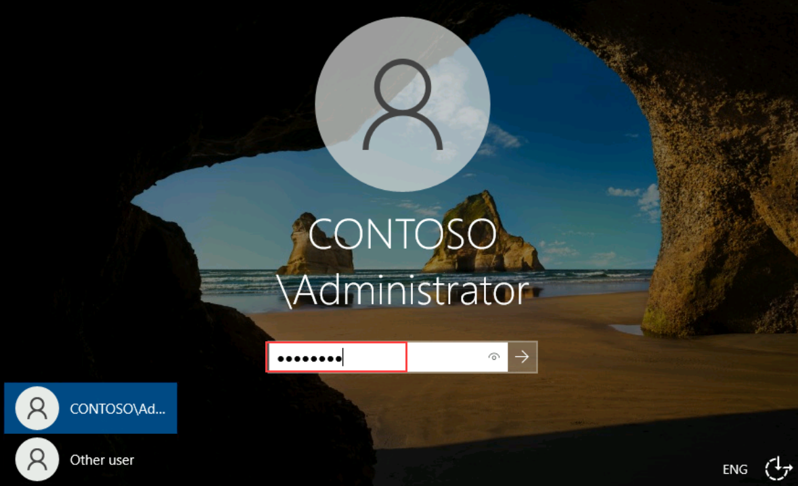
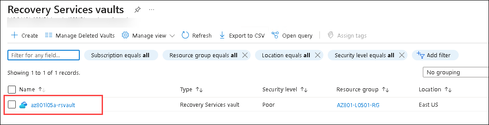

# Lab 05 : Implementing Azure-based recovery services

## Lab Overview

In this hands-on lab, you will configure and validate Azure Site Recovery for a Hyper-V virtual machine, review replication settings, perform a test failover, and explore failover options to ensure business continuity and disaster recovery readiness.

## Lab Objectives

In this lab, you will be working on:

- Exercise 1: Creating and configuring an Azure Site Recovery vault.
- Exercise 2: Implementing Hyper-V VM protection by using Azure Site Recovery vault.
- Exercise 3: Implementing Azure Backup

## Estimated timing: 150 minutes

## Architecture diagram


## Exercise 1: Creating and configuring an Azure Site Recovery vault

In this exercise, you will be introduced to Azure Site Recovery and guided through the process of creating and configuring a Recovery Services vault. The vault will be used to manage the disaster recovery and backup configurations of your workloads in Azure and on-premises environments.

### Task 1: Create an Azure Site Recovery vault

In this task, you will be creating a new Recovery Services vault in the Azure portal. You will select the appropriate subscription, resource group, and location, and then configure basic settings for the vault.

1. Connect to **SEA-SVR2**, by selecting the **SEA-SVR2** from the top menu drop down.

    

1. If needed, sign in as **CONTOSO\\Administrator** with the password **Pa55w.rd**.

    

1. On **SEA-SVR2**, click on **Azure Portal** shortcut to go to the Azure portal, and sign in by using the credentials of a user account with the Owner role in the subscription you'll be using in this lab.

    

1. On **Sign in to Microsoft Azure** blade, you will see a login screen, in that enter the following email/username and then click on **Next**. 
   
   * Email/Username: <inject key="AzureAdUserEmail"></inject>

1. Now enter the following password and click on **Sign in**.
   
   * Password: <inject key="AzureAdUserPassword"></inject>

     >**Note**: If prompted for MFA, please refer to the steps provided on the Getting Started page.
   
1. In the Azure portal, in the **Search resources, services, and docs** text box, on the toolbar, search for **Recovery Services vaults (1)** and select **Recovery Services vaults (2)**.

   

1. On the **Recovery Services vaults** page, select **+ Create**.

   

1. On the **Basics** tab of the **Create Recovery Services vault** page, specify the following settings (leave others with their default values) and select **Review + create (5)**:

   |Setting|Value|
   |---|---|
   |**Subscription**|Leave the default subscription **(1**)|
   |**Resource group**|**AZ801-L0501-RG (2)** |
   |**Vault name**|**az801l05a-rsvault (3)** |
   |**Location**|**<inject key="Resource group Region"></inject> (4)** |

    

1. On the **Review + create** tab of the **Create Recovery Services vault** page, select **Create**.
 
   

   > **Note:** Wait until the Recovery Services vault is provisioned. This should take about 2 minutes.

   > **Note:** By default, the Storage Replication type of the vault is set to Geo-redundant (GRS), as well as Soft Delete and Security Features are enabled. You will change these settings in the lab to simplify deprovisioning, but you should ensure they are enabled in your production environments.


### Task 2: Configure the Azure Site Recovery vault

In this task, you will configure the vault for disaster recovery operations. You will set up replication settings such as the storage replication type (Locally-Redundant) and implement security features like disabling soft delete.

1. On **SEA-SVR2**, in the Microsoft Edge window displaying the Azure portal, on the deployment page, select **Go to resource**. 

   

    > **Note:** This will automatically display the **az801l05a-rsvault** page.

1. On the **az801l05a-rsvault** page, on the vertical menu on the left side, in the **Settings** section, select **Properties (1)**.

1. On the **az801l05a-rsvault | Properties** page, select the **Update (2)** link under the **Backup Configuration** label.

   

1. On the **Backup Configuration** page, set **Storage replication type** to **Locally-redundant (1)**, select **Apply (2)** and **close (3)** the **Backup Configuration** page.

   

   > **Note:** Storage replication type cannot be changed after you implement protection.

1. On the **az801l05a-rsvault | Properties** page, select the **Update** link under the **Soft Delete  and security Settings** label.

    

1. On the **Security settings** page, Select **Disable(1)** for Soft Delete (For workloads running in azure), and select **Save (2)**

     

## Exercise 2: Implementing Hyper-V VM protection by using Azure Site Recovery vault

In this exercise, you will focus on protecting virtual machines running on Hyper-V. You will prepare your infrastructure, enable replication, and perform failover operations using Azure Site Recovery.

### Task 1: Implement an Azure recovery site

In this task, you will be setting up a recovery site by creating a virtual network and configuring its subnet. You will also set up a storage account with the necessary configuration to ensure proper communication with Azure Site Recovery.

1. On **SEA-SVR2**, in the Microsoft Edge window displaying the Azure portal, use the **Search resources, services, and docs** text box in the toolbar to search for **Virtual networks (1)** and select **Virtual networks (2)**.

   

1. On the **Virtual networks** page, select **+ Create**.

   

1. On the **Basics** tab of the **Create virtual network** page, specify the following settings (leave others with their default values) and select **IP Addresses (5)**:

   |Setting|Value|
   |---|---|
   |**Subscription**|Leave the default subscription **(1)**|
   |**Resource group**|**AZ801-L0502-RG** **(2)**|
   |**Virtual network Name**|**az801l05-dr-vnet** **(3)**|
   |**Region**|**<inject key="Resource group Region"></inject> (4)**|

    

1. On the **IP addresses** tab of the **Create virtual network** page,
    - Remove the default IP Address space by clicking on **Delete address space**

         
      
   - After deleting **address space**, select **Add IPV4 address space** specify the following settings (leave others with their default values).

      

       |Setting|Value|
       |---|---|
       |Starting Address|**10.5.0.0 (1)**|
       |Address space size|**/22 (1024 Addresses) (2)**|

       - On the **IP addresses** tab of the **Create virtual network** page, select **+ Add a subnet  (3)**.

         

1. On the **Add a subnet** page, specify the following settings (leave others with their default values) and select **Add (4)**:

   |Setting|Value|
   |---|---|
   |Name|**subnet0 (1)**|
   |Starting Address|**10.5.0.0 (2)**|
   |Subnet size|**/24 (256 Addresses) (3)**|

      
   
1. Back on the **IP addresses** tab of the **Create virtual network** page, select **Review + create**.

   

1. On the **Review + create** tab of the **Create virtual network** page, select **Create**.

   

1. On **SEA-SVR2**, in the Azure portal, browse back to the **Virtual networks** page and select **+ Create**.

   

1. On the **Basics** tab of the **Create virtual network** page, specify the following settings (leave others with their default values) and select **IP Addresses (5)**:

   |Setting|Value|
   |---|---|
   |**Subscription**|Leave the default subscription **(1)**|
   |**Resource group**|**AZ801-L0502-RG** **(2)**|
   |**Virtual network Name**|**az801l05-test-vnet** **(3)**|
   |**Region**|**<inject key="Resource group Region"></inject> (4)**|

   
   
1. On the **IP addresses** tab of the **Create virtual network** page,
    - Remove the default IP Address space by clicking on **Delete address space**

         
      
   - After deleting **address space**, select **Add IPV4 address space** specify the following settings (leave others with their default values).

      

       |Setting|Value|
       |---|---|
       |Starting Address|**10.5.0.0** **(1**)|
       |Address space size|**/22 (1024 Addresses)** **(2)**|

       - On the **IP addresses** tab of the **Create virtual network** page, select **+ Add a subnet (3)**.

         

   > **Note:** Ignore the warning regarding the overlapping IP address space. This is intentional, so the IP address space of the test environment matches the IP address space of the disaster recovery environment.

1. On the **Add a subnet** page, specify the following settings (leave others with their default values) and select **Add (4)**:

   |Setting|Value|
   |---|---|
   |Name|**subnet0 (1)** |
   |Starting Address|**10.5.0.0 (2)** |
   |Subnet size|**/24 (256 Addresses)** **(3)**|

      

1. Back on the **IP addresses** tab of the **Create virtual network** page, select **Review + create**.

   

1. On the **Review + create** tab of the **Create virtual network** page, select **Create**.

   

1. On **SEA-SVR2**, in the Azure portal, use the **Search resources, services, and docs** text box in the toolbar to search for **Storage accounts (1)** and select **Storage accounts (2)**.

   

1. On the **Storage accounts** page, select **+ Create**.

1. On the **Basics** tab of the **Create storage account** page, specify the following settings (leave others with their default values):

   |Setting|Value|
   |---|---|
   |Subscription|Leave the default subscription **(1)**|
   |Resource group|**AZ801-L0502-RG (2)** |
   |Storage account name|**storage<inject key="DeploymentID" enableCopy="false"/> (3)**|
   |Region|**<inject key="Resource group Region"></inject> (4)** |
   |Primary Serice|**Azure Blob Storage or Azure Data Lake Storage Gen 2 (5)**|   
   |Performance|**Standard (6)**|
   |Redundancy|**Locally redundant storage (LRS)(7)**|

    

1. On the **Basics** tab of the **Create a storage account** page, select the **Data protection** tab.

   

1. On the **Data protection** tab of the **Create a storage account** page, **Uncheck** the **Enable soft delete for blobs (1)** and **Enable soft delete for containers (2)** checkboxes and select **Review + create(3)**.

   

    > **Note:** These settings must be disabled when using the storage account for Azure Site Recovery.

1. On the **Review + create** tab of the **Create storage account** page, select **Create**.

   

### Task 2: Prepare protection of a Hyper-V virtual machine

In this task, you will add a Hyper-V site to your Recovery Services vault and install the Azure Site Recovery Provider on the Hyper-V host. This will enable the replication of Hyper-V VMs to Azure.

1. On **SEA-SVR2**, in the Microsoft Edge window displaying the Azure portal, use the **Search resources, services, and docs** text box in the toolbar to search for **Recovery Services vaults (1)** and select **Recovery Services vaults (2)**.

   

1. On the **Recovery Services vaults** page, select the **az801l05a-rsvault** entry.

   

1. On the **az801l05a-rsvault** page, on the right side under **Overview (1)**, in the **Site Recovery** section, select **Getting started (2)** .

   

1. On the **az801l05a-rsvault \| Site Recovery** page, in the **Hyper-V machines to Azure** section, select **1. Prepare infrastructure**. 

   

1. On the **Deployment planning** tab of the **Prepare infrastructure** page, in the **Deployment planning completed?** drop-down list, select **Yes, I have done it (1)** and select **Next (2)**.

   

1. On the **Source settings** tab of the **Prepare infrastructure** page, 

   - Next to the **Are you Using System Center VMM to manage Hyper-V hosts** label, select the **No (1)** option.
   - On the **Source settings** tab of the **Prepare infrastructure** page, select the **Add Hyper-V site (2)** link. 
   - On the **Create Hyper-V Site** page, in the **Name** text box, enter **az801l05-site(3)** and select **OK (4)**.

     

      > **Note:** Do not close the browser window as we will be using it for further tasks.

1. In Windows Start, search for **Group Policy Management (1)** and select **Group Policy Management (2)**.

   

1. On the **Group Policy Management** Editor and edit the following policy. Select **Default Domain Policy (1)**, and then right-click and click **Edit (2)**.

    

1. Select **Computer Configuration (1) > Policies (2) > Administrative Templates (3) > Windows Components (4)**.

   

1. Scroll down and select **Windows Update (1)**. Select the policy **Configure Automatic Updates (2)** and click on **policy setting (3)**.

   

1. In the Computer Updates page, select **Enabled (1)**, and then click **OK (2)**.

   

1. In Windows Start, search for **Powershell (1)**, right click on **Windows Powershell (2)** and select **Run as administrator (3)**.   

   

1. Run the following commands to update Group Policy and update Windows Update services: 

   ```powershell
   Invoke-GPUpdate -Force
   Get-Service wuauserv | Set-Service -StartupType Manual
   Get-Service wuauserv | Start-Service
   ```

    

1. Switch back to the Microsoft Edge window displaying the Azure portal, on the **Source settings** tab of the **Prepare infrastructure** page, select the **Add Hyper-V server (1)** link. 

   - On the **Add Server** page, select the **Download (2)** link in **step 3** of the procedure for adding on-premises Hyper-V hosts in order to download the installer for Microsoft Azure Site Recovery Provider.

     

      >**Note:** If you receive the Microsoft Edge notification that **AzureSiteRecoveryProvider.exe can't be downloaded securely**, move the cursor over the right side of the message to reveal the ellipsis symbol (**...**), select it, in the drop-down menu, select **Copy download link**, open another tab in the same Microsoft Edge window, paste the link you copied, and then press Enter.

1. In the download notification, select **Open file**. This will start the **Azure Site Recovery Provider Setup (Hyper-V server)** wizard.

   

1. On the **Microsoft Update** page, select **Off (1)** and select **Next (2)**.

   

1. On the **Provider installation** page, select **Install**.

    
    > **Note:** Please donot close the Microsoft Azure Site Recovery Registration Wizard

1. Switch to the Microsoft Edge window displaying the Azure portal, and in the **Add Server** page, select the **Download** button in **step 4** of the procedure for registering on-premises Hyper-V hosts in order to download the vault registration key.

    

1. Switch to the **Provider installation** wizard and select **Register**. This will start the **Microsoft Azure Site Recovery Registration Wizard**.

    

1. On the **Vault Settings** page of the **Microsoft Azure Site Recovery Registration Wizard**, select **Browse**. 

    

1. In the **Open** window, browse to the **Downloads (1)** folder, select the vault credentials file **(2)**, and select **Open (3)**.

    

1. Back on the **Vault Settings** page of the **Microsoft Azure Site Recovery Registration Wizard**, select **Next**.

   

1. On the **Proxy Settings** page of the **Microsoft Azure Site Recovery Registration Wizard**, accept the default settings and select **Next**.

   

1. On the **Registration** page of the **Microsoft Azure Site Recovery Registration Wizard**, select **Finish**.

   

   > **Note:** Sometimes finishing might take around 5 - 10 mins. Please wait untill it finishes.

   > **Note:** In case the registration fails, select **Start**. On the **Start** menu, select the **Azure Site Recovery Services Provider** folder. In the folder, select **Azure Site Recovery Configurator** and re-run the registration procedure.

1. Switch back to the Microsoft Edge window displaying the Azure portal, **close** the **Add Server** page.

    

1. **Refresh** the page. 
 
    

1. When prompted, select **Reload**. 

   
 
1. On the **Deployment planning** tab of the **Prepare infrastructure** page, in the **Deployment planning completed?** drop-down list, select **Yes, I have done it (1)** and select **Next (2)**.

   

1. On the **Source settings** tab of the **Prepare infrastructure** page, next to the **Are you Using System Center VMM to manage Hyper-V hosts** label, select the **No (1)** option.
Verify that the **Hyper-V site** and **Hyper-V servers** settings are set correctly **(2)** and select **Next (3)**. 

    

1. On the **Target settings** tab of the **Prepare infrastructure** page, accept the default settings and select **Next**.

1. On the **Replication policy** tab of the **Prepare infrastructure** page, select **Create new policy and associate**. 

    

1. On the **Create and associate policy** page, specify the following settings (leave others with their default values) and select **OK (3)**:

   |Setting|Value|
   |---|---|
   |Name|**az801l05-replication-policy** (1)|
   |Copy frequency|**30 seconds** (2)|

   

1. Back on the **Replication policy** tab of the **Prepare infrastructure** page, wait until the site has been associated with the policy **(1)** and select **Next (2)**.

   

1. On the **Review** tab of the **Prepare infrastructure** page, select **Prepare**.

   

### Task 3: Enable replication of a Hyper-V virtual machine

In this task, you will be enabling replication for a selected Hyper-V virtual machine. This will ensure that the VM is replicated to Azure for disaster recovery purposes, providing a failover solution in case of an outage.

1. On **SEA-SVR2**, in the Microsoft Edge window displaying the Azure portal, select **az801l05a-rsvault**

   

1. On the **az801l05a-rsvault**, navigate to **Site Recovery (1)** page under Getting Started, in the **Hyper-V machines to Azure** section, select **2. Enable replication (2)**. 

   

1. On the **Source environment** tab of the **Enable replication** page, in the **Source location** drop-down list, select **az801l05-site (1)** if not selected and click on **Next (2)**.

   

1. On the **Target environment** tab of the **Enable replication** page, specify the following settings (leave others with their default values) and select **Next (9)**:

   |Setting|Value|
   |---|---|
   |**Subscription**|the name of the Azure subscription you are using in this lab (1)|
   |**Post-failover resource group**|**AZ801-L0502-RG** (2)|
   |**Post-failover deployment model**|**Resource Manager (3)**|
   |**Storage type**|Storage account (4)|
   |**Storage account**|storage<inject key="DeploymentID" enableCopy="false"/> (5)|
   |**Network**|Configure now for selected machines (6)|
   |**Virtual network**|**az801l05-dr-vnet (7)**|
   |**Subnet**|**subnet0 (10.5.0.0/24) (8)**|

   
   

1. On the **Virtual machine selection** tab of the **Enable replication** page, select the **SEA-CORE1 (1)** checkbox and select **Next (2)**.

    

1. On the **Replication settings** tab of the **Enable replication** page, in the **Defaults** row and **OS type** column, select **Windows (1)** from the drop-down list and select **Next (2)**.

   

1. On the **Replication policy** tab of the **Enable replication** page, accept the default settings and select **Next**.
1. On the **Review** tab of the **Enable replication** page, select **Enable replication**.

   

   >**Note:** If you receive an error that the replication could not be enabled, please verify the **soft delete for blob and container is disabled in the storage account** and restart the replication job again.
      

### Task 4: Review Azure VM replication settings

In this task, you will review the replication settings for the SEA-CORE1 virtual machine, checking its replication health, synchronization status, and recovery points. You'll also monitor its failover readiness and review infrastructure details while ensuring that the VM status updates to Protected after synchronization.

1. On **SEA-SVR2**, in the Microsoft Edge window displaying the Azure portal, back on the **az801l05a-rsvault \| Site Recovery** page, on the vertical menu on the left side, select **Replicated items (1)** under Protected items. 

1. On the **az801l05a-rsvault \| Replicated items** page, ensure that there is an entry representing the **SEA-CORE1 (2)** virtual machine and verify that its **Replication Health** is listed as **Healthy** and that its **Status** is listed as either **Enabling protection** or displaying a current percentage of synchronization progress.

   

   > **Note:** You might need to wait a few minutes until the **SEA-CORE1** entry appears on the **az801l05a-rsvault \| Replicated items** page.

1. On the **az801l05a-rsvault \| Replicated items** page, select the **SEA-CORE1** entry.

   

1. Initially the state will be in **% Synchronized**.

   

1. Wait until the status changes to **Protected**. On the **SEA-CORE1** replicated items page, review the **Health and status**, **Failover readiness**, **Latest recovery points**, and **Infrastructure view** sections. Note the **Planned Failover**, **Failover** and **Test Failover** toolbar icons.

   

    > **Note:** The time required for this to take place depends on the available bandwidth of the connection between the lab environment and the Azure region hosting the Recovery Services vault. You will need to refresh the browser page for the status to be updated (**This process might take about 15-20 minutes**). 

1. On the **SEA-CORE1** replicated items page, select **Latest recovery points** and review **Latest crash-consistent** and **Latest app-consistent** recovery points. 

    

   > **Note:** It might take few minutes to load.

### Task 5: Perform a failover of the Hyper-V virtual machine

In this task, you will perform a test failover for the SEA-CORE1 virtual machine, monitor the job's progress, and clean up the test failover. You will also review and validate the failover options, including performing a planned and unplanned failover without initiating them.

In this task, you will perform a failover of the Hyper-V virtual machine.

1. On **SEA-SVR2**, in the browser window displaying the Azure portal, on the **SEA-CORE1** replicated items blade go to the **Compute and Network setting (1)** under General and review the virtual machine size. Validate that the size is set to A1_v2, if not **edit** the size to be **A1_v2 (2)** and click on **Save (3)**.

    

1. Go back to the **Overview (1)** and select **Test failover (2)**.

    

1. Initiate **Test failover** with the following settings (leave others with their default values) and select **OK (2)**:

   |Setting|Value|
   |---|---|
   |Azure virtual network|**az801l05-test-vnet (1)** |

    

1. In the Azure portal, browse back to the **az801l05a-rsvault** page, and on the vertical menu on the left side, in the **Monitoring** section, select **Site Recovery jobs (1)**. Initially the status of the **Test failover** job is listed as **In progress (2)**.

    

1. Wait until the status of the **Test failover** job is listed as **Successful** before proceeding to the next step.

    

     > **Note:** The time required for the test failover to complete depends on the available bandwidth of the connection between the lab environment and the Azure region hosting the Recovery Services vault. You will need to refresh the browser page for the status to be updated (**this process might take about 15-20 minutes**). 

1. In the Azure portal, use the **Search resources, services, and docs** text box in the toolbar to search for and select **Virtual machines** and, on the **Virtual machines** page, note the entry representing the newly provisioned virtual machine.

   

   > **Note:** Initially, the virtual machine will have the name consisting of the **asr-** prefix and randomly generated suffix, but will be renamed eventually to **SEA-CORE1-test**. Please wait it may take around 5 mins.

1. In the Azure portal, browse back to the **SEA-CORE1** replicated item page and select **Cleanup test failover**.

   

1. On the **Test failover cleanup** page, select the **Testing is complete. Delete test failover virtual machine(s) (1)** checkbox and select **OK (2)**.

   

1. After the test failover cleanup job completes, refresh the browser page displaying the **SEA-CORE1** replicated items page and note that you have the option to perform **planned and unplanned failover** (the latter is labeled as **Failover**).

    

   > **Note:** The unplanned failover option is labeled as **Failover**.

1. On the **SEA-CORE1** replicated items page, select **Planned failover**. 

    

1. On the **Planned failover** page, note that the failover direction settings are already set and not modifiable. 

    

1. Close the **Planned failover** page without initiating a failover, and on the **SEA-CORE1** replicated items page, select **Failover**. 

    

1. On the **Failover** page, note that you have the option to choose a recovery point. 

    

1. Close the **Failover** page without initiating a failover.

## Exercise 3: Implementing Azure Backup

In this exercise, you will be setting up and configuring Azure Backup to protect critical files and folders on your server, ensuring that your data is securely backed up and recoverable in case of any failure or data loss.

### Task 1: Set up the Azure Recovery Services agent

In this task, you will uninstall any existing Azure Recovery Services agent on the server, SEA-SVR2, and install the necessary components to enable Azure Backup functionality. You will register the server with the Azure Recovery Services vault to ensure proper communication for backup operations.

> **Note:** In general, the same vault can be used to implement Azure Site Recovery and Azure Backup functionality. When choosing the Azure region to host the vault for the purpose of disaster recovery and backup, you should take into account recovery objectives, including the range of impact of a regional disaster as well as network latency considerations. In this lab, you will use the same vault for site recovery and backup to minimize the number of duplicate steps. 

> **Note:** To implement Azure Backup, you will be installing the Azure Recovery Services agent on **SEA-SVR2**, which already serves as the **Microsoft Azure Site Recovery Provider**. To eliminate dependency issues, you will start by uninstalling the existing installation of Azure Recovery Services agent.

1. On **SEA-SVR2**, select **Start**, and on the **Start (1)** menu, select the **Settings (2)** app.

    

1. In the **Settings** app, select **Apps**.

    

1. In the **Apps & features (1)** pane, select **Microsoft Azure Recovery Services Agent (2)**, select **Uninstall (3)**, and follow the prompts to uninstall it **(4)**.

    

     > **Note:** If you are getting an error message that says the installation has failed, then restart the VM and try again. 

1. Click on **Uninstall**.

    

1. Click on **Finish**.

    

1. On **SEA-SVR2**, in the Microsoft Edge window displaying the Azure portal, on the **az801l05a-rsvault** Recovery Services vault page, on the vertical menu on the left side, in the **Getting started** section, select **Backup (1)**.

1. On the **az801l05a-rsvault \|Backup (1)** page, specify the following settings:

   |Settings| Value|
   |---|---|
   |Where is your workload running?|**On-premises (2)**|
   |What do you want to back up?|**Files and folders (3)**|

   - On the **az801l05a-rsvault \|Backup** page, select **Prepare Infrastructure (4)**.

     

1. On the **Prepare infrastructure** page, select the **Download Agent for Windows Server or Windows Client** link.

   

1. After the download completes, in the **Downloads** notification of Microsoft Edge, select the **Open file** link. 

   

    > **Note:** This will start the **Microsoft Azure Recovery Services Agent Setup Wizard**, which, in this case, will launch automatically the **Register Server Wizard**.

1. On the **Installation Settings** page of the **Microsoft Azure Recovery Services Agent Setup Wizard**, accept the default settings and select **Next**.

   

1. On the **Proxy Configuration** page of the **Microsoft Azure Recovery Services Agent Setup Wizard**, accept the default settings, and then select **Next**. 

   

1. On the **Microsoft Update Opt-in** page of the **Microsoft Azure Recovery Services Agent Setup Wizard**, select **I do not want to use Microsoft Update (1)** and select **Next (2)**.

   
   
1. On the **Installation** page of the **Microsoft Azure Recovery Services Agent Setup Wizard**, select **Install**.

   
   
1. After the installation completes, on the **Installation** page of the **Microsoft Azure Recovery Services Agent Setup Wizard**, select **Proceed to Registration**. This will launch the **Register Server Wizard**.

   

1. Switch to the Microsoft Edge window displaying the Azure portal, on the **Prepare infrastructure** page, select the **Already downloaded or using the latest Recovery Server Agent (1)** checkbox , and select **Download (2)**.

     

1. If prompted, whether to open or save the vault credentials file, select **Save**. This will save the vault credentials file to the local Downloads folder.

1. Switch back to the **Register Server Wizard**, and on the **Vault Identification** page, select **Browse (1)**. In the **Select Vault Credentials** dialog box, browse to the **Downloads (2)** folder, select the vault credentials file you downloaded **(3)**, and then select **Open (4)**. 

   

1. Then select **Next** to open the **Encryption Setting** page.

   

1. On the **Encryption Setting** page of the **Register Server Wizard**, select **Generate Passphrase**.

    

1. On the **Encryption Setting** page of the **Register Server Wizard**, uncheck **Save passphrase securely to Azure Key vault (Recommended) (1)** if prompt **Encryption Setting** select **Yes**.

1. On the **Encryption Setting** page of the **Register Server Wizard**, select the **Browse (2)** button next to the **Enter a location to save the passphrase** drop-down list.

   

1. In the **Browse For Folder** dialog box, expand **This PC (1)** node, select the **Documents (2)** subfolder, and then select **OK (3)**.

   

1. Select **Finish**, review the **Microsoft Azure Backup** warning, select **Yes**, and wait for the registration to complete.

   

    > **Note:** In a production environment, you should store the passphrase file in a secure location other than the server being backed up.

1. On the **Server Registration** page of the **Register Server Wizard**, review the warning regarding the location of the passphrase file, ensure that the **Launch Microsoft Azure Recovery Services Agent (1)** checkbox is selected, and then select **Close (2)**. This will automatically open the **Microsoft Azure Backup** console.

    

### Task 2: Schedule Azure Backup

In this task, you will configure a scheduled backup for your server, SEA-SVR2, by selecting specific files (like the hosts file) and defining a backup schedule. You will also configure retention policies and choose the type of backup (initial or incremental) to optimize storage and backup management.

1. On **SEA-SVR2**, in the **Microsoft Azure Backup** console, in the Actions pane, select **Schedule Backup**.

   

1. In the **Schedule Backup Wizard**, on the **Getting started** page, select **Next**.
1. On the **Select Items to Backup** page, select **Add Items (1)**.

   

1. In the **Select Items** dialog box, browse to the **C:\\Windows\\System32\\drivers\\etc\\** folder, select **hosts (1)**, and then select **OK (2)**.

   

1. On the **Select Items to Backup** page, select **Next**.

   

1. On the **Specify Backup Schedule** page, ensure that the **Day (1)** option is selected, in the first drop-down list box below the **At following times (Maximum allowed is three times a day)** box, select **4:30 AM (2)**, and then select **Next**.

   

1. On the **Select Retention Policy (Files and Folders)** page, accept the defaults, and then select **Next**.

1. On the **Choose Initial Backup type (Files and Folders)** page, accept the defaults, and then select **Next**.

1. On the **Confirmation** page, select **Finish**. When the backup schedule is created, select **Close**.

   

### Task 3: Perform an on-demand backup

In this task, you will initiate an on-demand backup after scheduling the backup in the previous task. You will select the files to back up, define retention settings, and verify that the backup completes successfully.

> **Note:** The option to run backup on demand becomes available after you create a scheduled backup.

1. In the **Microsoft Azure Backup** console, in the Actions pane, select **Back Up Now**.

   

1. In the **Back Up Now Wizard**, on the **Select Backup Item** page, ensure that the **Files and Folders (1)** option is selected and select **Next (2)**.

   

1. In the **Back Up Now Wizard**, on the **Select Items to Backup** page, ensure that the **C:\ (1)** option is selected and select **Next (2)**.

   

1. On the **Retain Backup Till** page, accept the default setting and select **Next**.

   

1. On the **Confirmation** page, select **Back Up**.

   

1. When the backup is complete, select **Close**.

   

1. On **SEA-SVR2**, switch to the Microsoft Edge window displaying the Azure portal, browse back to the **az801l05a-rsvault** Recovery Services vault page and select **Backup items**. 

1. On the **az801l05a-rsvault \| Backup items** page, select the **Azure Backup Agent** entry.

   

1. On the **Backup Items (Azure Backup Agent)** page, verify that there is an entry referencing drive **C** of **sea-svr2.contoso.com**.

   

### Task 4: Perform file recovery by using Azure Recovery Services agent

In this task, you will simulate a data loss by deleting a critical file (the hosts file) and then use the Azure Recovery Services agent to recover the file from a previous backup. You will perform the recovery through the Azure Backup console, mount the backup, and use the robocopy command to restore the file to its original location.

1. On **SEA-SVR2**, open **File Explorer (1)**, browse to the **C:\\Windows\\System32\\drivers\\etc\\ (2)** folder and delete the **hosts (3)** file.

   

1. Switch to the **Microsoft Azure Backup** window and select **Recover data**. This will start the **Recover Data Wizard**.

     

1. On the **Getting Started** page of the **Recover Data Wizard**, ensue that **This server (sea-svr2.contoso.com) (1)** option is selected and select **Next (2)**.

   

1.  On the **Select Recovery Location** page, leave all the default values and select **Next**.

1. On the **Select Recovery Mode** page, ensure that **Individual files and folders (1)** option is selected, and select **Next (2)**.

   

1. On the **Select Volume and Date** page, in the **Select the volume** drop-down list, select **C:\\ (1)**, accept the default selection of the available backup, and select **Mount (2)**. 

   

    > **Note:** Wait for the mount operation to complete. This might take about 2 minutes.

1. On the **Browse And Recover Files** page, note the **drive letter** of the recovery volume **(1)**, select **Browse (2)**.

   

1. Review the tip regarding the use of **Robocopy** and close it.

1. Select **Start (1)**, expand the **Windows System (2)** folder, and then select **Command Prompt (3)**.

   

1. From the **Administrator: Command Prompt** window, run the following to copy the restore the **hosts** file to the original location (replace the `<recovery_volume>` placeholder with the drive letter of the recovery volume you identified earlier):

   ```cmd
   robocopy <recovery_volume>:\Windows\System32\drivers\etc C:\Windows\system32\drivers\etc hosts /r:1 /w:1
   ```

       

1. From the **Administrator: Command Prompt** window, run the following to verify that the file has been restored:

   ```cmd
   dir C:\Windows\system32\drivers\etc\hosts
   ```

    

1. Switch back to the **Recover Data Wizard**, and on the **Browse and Recover Files** page, select **Unmount (1)**, and when prompted to confirm, select **Yes (2)**. 

   

### Review
In this lab, you have completed:
- Created and configured an Azure Site Recovery vault.
- Implemented Hyper-V VM protection by using Azure Site Recovery vault.
- Implemented Azure Backup

## You have successfully completed the lab.
