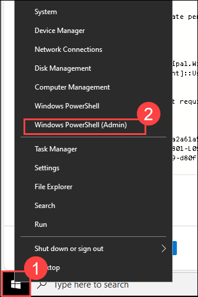
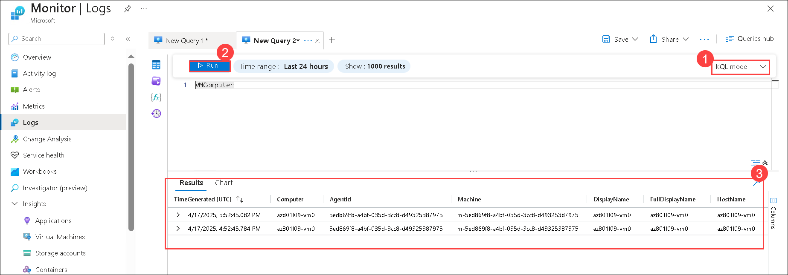

# Lab 09: Implementing operational monitoring in hybrid scenarios

## Lab Objectives
In this lab, you will complete the following tasks:
+ Exercise 1: Preparing a monitoring environment
+ Exercise 2: Configuring monitoring of on-premises servers
+ Exercise 3: Configuring monitoring of Azure VMs
+ Exercise 4: Evaluating monitoring services

## Estimated timing: 90 minutes

## Architecture diagram


## Exercise 1: Preparing a monitoring environment

### Task 1: Deploy an Azure virtual machine

1. Connect to **SEA-SVR2**, by selecting the **SEA-SVR2** from the top menu drop down.

    

1. If needed, sign in as **CONTOSO\\Administrator** with the password **Pa55w.rd**.

    

1. On **SEA-SVR2**, click on **Azure Portal** shortcut to go to the Azure portal, and sign in by using the credentials of a user account with the Owner role in the subscription you'll be using in this lab.

    

1. On **Sign in to Microsoft Azure** blade, you will see a login screen, in that enter the following email/username and then click on **Next**. 
   
   * Email/Username: <inject key="AzureAdUserEmail"></inject>

1. Now enter the following password and click on **Sign in**.
   
   * Password: <inject key="AzureAdUserPassword"></inject>

     >**Note**: If prompted for MFA, please refer to the steps provided on the Getting Started page.

1. On **SEA-SVR2/LabVM**, in the Microsoft Edge window displaying the Azure portal, open the Azure Cloud Shell pane by selecting the Cloud Shell button in the Azure portal.

   

1. Selecting a ***PowerShell*** environment and creating storage if prompted. The cloud shell provides a command line interface in a pane at the bottom of the Azure portal, as shown here:

   

1. Within the Getting Started pane, select **Mount storage account (1)**, select your **Storage account subscription (2)** from the dropdown and click **Apply (3)**.

   

1. Within the **Mount storage account** pane, select **I want to create a storage account (1)** and click **Next (2)**.

   

1. If you are prompted to create storage for your Cloud Shell, enter the following deatils and then click on **Create (6)**

   - Subscription: Ensure your subscription is selected **(1)** 
   - Resource group: Please make sure you have selected your resource group **az-801 (2)**
   - Region: Select **East US (3)**
   - Storage account name: Enter **blob<inject key="DeploymentID" enableCopy="false"/> (4)**
   - File share name: Enter **fs<inject key="DeploymentID" enableCopy="false"/> (5)**

        

1. Wait for PowerShell terminal to start.

1. In the toolbar of the Cloud Shell pane, select the **Manage files (1)** icon, in the drop-down menu select **Upload (2)**.

   

1. Navigate to **C:\\Labfiles\\Lab09 (1)**, select **L09-rg_template.json (2)** and then click on **Open (3)**.

   

1. Repeat the previous step to upload the **C:\\Labfiles\\Lab09\\L09-rg_template.parameters.json** file into the Cloud Shell home directory.

   

1. To create the resource group that will be hosting the lab environment, in the **PowerShell** session in the Cloud Shell pane, enter the following commands, and after entering each command, press **Enter** 

   ```powershell 
   $location = '<inject key="Resource group Region" enableCopy="false"/>'
   $rgName = 'AZ801-L0901-RG'
   New-AzResourceGroup -ResourceGroupName $rgName -Location $location
   ```

       

1. To deploy an Azure virtual machine (VM) into the newly created resource group, enter the following command and press Enter:

   ```powershell 
   New-AzResourceGroupDeployment -Name az801l0901deployment -ResourceGroupName $rgName -TemplateFile ./L09-rg_template.json -TemplateParameterFile ./L09-rg_template.parameters.json -AsJob
   ```

    

1. When prompted, insert the credentials provided by your instructor.

   >**Note**: Do not wait for the deployment to complete but instead proceed to the next task. The deployment should take about 3 minutes.

### Task 2: Register the Microsoft.Insights and Microsoft.AlertsManagement resource providers

1. To register the Microsoft.Insights and Microsoft.AlertsManagement resource providers, on **SEA-SVR2**, from the Cloud Shell pane, enter the following commands, and after entering each command, press Enter.

   ```powershell
   Register-AzResourceProvider -ProviderNamespace Microsoft.Insights
   Register-AzResourceProvider -ProviderNamespace Microsoft.AlertsManagement
   ```

       

     >**Note**: To verify the registration status, you can use the **Get-AzResourceProvider** cmdlet.

1. Close Cloud Shell.

   >**Note**: Do not wait for the registration process to complete but instead proceed to the next task. The registration should take about 3 minutes.

### Task 3: Create and configure an Azure Log Analytics workspace

1. On **SEA-SVR2**, in the Azure portal, in the **Search resources, services, and docs** text box, in the toolbar, search for and select **Log Analytics workspaces (1)**, and then, from the **Log Analytics workspaces (2)** page.

   

1. Select **+ Create**.

   

1. On the **Basics** tab of the **Create Log Analytics workspace** page, enter the following settings, select **Review + Create (5)**:

   | Settings | Value |
   | --- | --- |
   | Subscription | the name of the Azure subscription you are using in this lab **(1)** |
   | Resource group | **AZ801-L0901-RG (2)** |
   | Name | **workspace<inject key="DeploymentID" enableCopy="false"/> (3)** |
   | Region | **<inject key="Resource group Region" enableCopy="false"/> (4)** |

       

     >**Note**: Make sure that you specify the same region into which you deployed virtual machines in the previous task.

1. Then select **Create**.

   

1. Wait for the deployment to complete. Then select **Go to resource**.

      

> **Congratulations** on completing the task! Now, it's time to validate it. Here are the steps:
 
- Hit the Validate button for the corresponding task. If you receive a success message, you can proceed to the next task. 
- If not, carefully read the error message and retry the step, following the instructions in the lab guide.
- If you need any assistance, please contact us at cloudlabs-support@spektrasystems.com. We are available 24/7 to help you out.

   <validation step="aff339d6-08b7-41bd-8563-5c676e0daff7" />   

## Exercise 2: Configuring monitoring of on-premises servers

### Task 1: Install the Azure Connect Machine Agent

1. On **SEA-SVR2**, in the Microsoft Edge window displaying the Azure portal, type **Arc (1)**, then select **Azure Arc (2)**.

    

1. In the navigation pane under **Azure Arc resources**, select **Machines (1)**. Select **+ Add/Create (2)**, and in the dropdown and then select **Add a machine (3)**.

     

1. Select **Generate script** from the **Add a single server** section. 

     

1. In the **Add a server with Azure Arc** page, under **Project details**, 

   - Subscription: Leave the default one **(1)**
   - Resource group: Select the **AZ801-L0901-RG (2)** resource group

   - Region: Select the **<inject key="Resource group Region" enableCopy="false"/> (3)** region into which you deployed the virtual machine in the previous task.

   - Review the SQL Server and Connectivity options. **Uncheck (4)**  Connect SQL Server, accept the remaining default values and select **Next (5)**. 

      

1. In the **Tags** tab, review the default available tags and Select **Next**. 

1. In the **Add a server with Azure Arc** tab, scroll down and select the **Download** button.

     

     >**Note**: if your browser blocks the download, allow it in the Microsoft Edge browser; select the ellipsis button (…), and then select **Keep**. 

      

1. Right-click the **Windows Start (1)** button and select **Windows PowerShell (Admin) (2)**.

    

     >If you get a UAC prompt, enter the credentials provided by your instructor. 
 
1. Enter the below command to navigate to the folder location where you downloaded the script. 

   ```powershell 
   cd C:\Users\Administrator.CONTOSO\Downloads
   ```

       

1. Enter the following command to change the execution policy:

   ```powershell 
   Set-ExecutionPolicy -ExecutionPolicy Unrestricted
   ```
1. Enter A for Yes to All and press Enter.

    
 
1. Enter the following command and press **Enter**. 

   ```powershell 
   .\OnboardingScript.ps1
   ```

1. Enter **R** to **Run once** and press **Enter** (this may take a couple minutes).

    

1. The setup process opens a new Microsoft Edge browser tab to authenticate the Azure Arc agent. Select your administrator account **<inject key="AzureAdUserEmail"></inject>**.

    

1. Wait for the message **Authentication complete**. 

    

1. Return to Windows PowerShell and wait for the installation to complete before closing the window.

    

1. Return to the Azure portal page where you downloaded the script and select **Close**.

    

1. Close the **Add servers with Azure Arc** page and navigate back to the **Azure Arc Machines** page.

    

1. Select **Refresh** until the **SEA-SVR2** server name appears and the Status is  **Connected** in the Arc console.

    

> **Congratulations** on completing the task! Now, it's time to validate it. Here are the steps:
 
- Hit the Validate button for the corresponding task. If you receive a success message, you can proceed to the next task. 
- If not, carefully read the error message and retry the step, following the instructions in the lab guide.
- If you need any assistance, please contact us at cloudlabs-support@spektrasystems.com. We are available 24/7 to help you out.

   <validation step="229783d9-a27e-4d47-8cc8-7a05331bcfd6" />      

### Task 2: Enable Monitoring using Insights

1. Navigate to Azure Arc from the Azure portal search window, select **SEA-SVR2** Azure Arc machine, and open the **SEA-SVR2** Arc machine.

    

1. In the navigation pane, under **Monitoring (1)** select **Insights (2)**, and select **Enable (3)**

     
.
1. On the **Monitoring configuration** page, under **Data collection rule**, select **Create New**.

    

1.	In the **Create new rule** page, enter the following settings and then select **Create (4)**:

      | Settings | Value |
      | --- | --- |
      | Data collection rule name | **Arc (1)** |
      | Enable processes and dependencies (Map) | **Enabled (2)** |
      | Subscription | Leave the default value |
      | Log Analytics Workspace | **workspace<inject key="DeploymentID" enableCopy="false"/> (3)** |

       

1. Select **Configure**.

    

     >**Note**:This deployment may take several minutes. Wait until the deployment completes before continuing with the next exercise.

### Task 3: Enable monitoring and diagnostic settings

1. On **SEA-SVR2**, in the Microsoft Edge window displaying the Azure portal, in the Search bar of the Azure portal, search for **Data collection rules (1)** and select **Data collection rules (2)**.

    

1.	In the **Data collection rules** page, select the **MSVM1-Arc** data collection rule you created earlier.

    

1.	Under **Configuration**, select **Data sources (1)** and select **Performance counters (2)**.

    

1.	In the **Add data source** page, in the **Basic** tab, select **all (1)** Performance counters. Change the sample rate for each counter to **10 seconds (2)** and select **Save (3)**.

    

1.	Under **Monitoring (1)**, select **Diagnostic settings (2)** and select **+ Add Diagnostic setting (3)**.

    

1. On the **Diagnostic setting** page,

   - Enter **ArcDiagSettings (1)** for the name of the **Diagnostic setting**
   - Under **Metrics**, select **All metrics (2)**
   - Under **Destination details**, select **Send to Log Analytics workspace (3)**
   - Use the name of the Azure subscription you are using in this lab **(4)**
   - Select the Log Analytics workspace you created earlier **(5)** 
   - Select **Save (6)** 

     

1. Close the **Diagnostic settings** window.     

## Exercise 3: Evaluating monitoring services

### Task 1: Review Azure Monitor monitoring and alerting functionality

1.	On **SEA-SVR2**, in the Azure portal, search for **Alerts (1)** and select **Alerts (2)** to navigate to **Monitor | Alerts** page.

    

1.	On the **Alerts (1)** page, select **+ Create (2)** and then select **Alert rule (3)**

    

1.	In the **Select a resource** page, in the **Browse** tab, expand **AZ801-L0901-RG (1)** and select the **SEA-SVR2 (2)** Azure Arc machine and then select **Apply (3)**.

    

1.	Select **Next: Condition >**

    

1. In the **Create an alert rule** page, in the **Select a signal** drop-down, select **Custom log search**.

    

1. Close the query pop window.

    

1.	In the query window, copy and paste the following KQL query:

      ```kql
      // Chart CPU usage trends by computer
      // Calculate CPU usage patterns over the last hour, chart by percentiles.
      InsightsMetrics
      | where TimeGenerated > ago(1h)
      | where Origin == "vm.azm.ms"
      | where Namespace == "Processor"
      | where Name == "UtilizationPercentage"
      | summarize avg(Val) by bin(TimeGenerated, 5m), Computer //split up by computer
      | render timechart
      ```

            

1. Click on **View result and edit in query logs**.

    

1.	Set the query mode to **KQL mode (1)**, select **Run (2)** and view the data in the **Results (3)**.

    

1. View the data in the **Chart** tabs.

    

1.	Scroll down and select **Continue Editing Alert**.

    

1.	In the **Create an alert rule** page, under **Measurement**, specify the following settings, and leave the other settings with their default values:

      | Settings | Value |
      | --- | --- |
      | **Aggregation granularity** | 1 minute |

             

1.	Under **Alert logic**, enter the following settings and then select **Next: Actions > (4)**.

      | Settings | Value |
      | --- | --- |
      | Operator | **Greater than (1)** |
      | Threshold value | **10 (2)** |
      | Frequency of evaluation | **1 minute (3)** |

               

1. In the **Action** tab of the **Create an alert rule** page, in the **select action** section, select **use action groups**.

      

1. In the **select action groups** page select **create action group**.

    

1. In the **Create action group** page, enter the following settings and then select **Next: Notifications > (5)**.

      | Settings | Value |
      | --- | --- |
      | Subscription | the name of the Azure subscription you are using in this lab **(1)** |
      | Resource group | **AZ801-L0901-RG (2)** |
      | Region | Leave the default setting  |
      | Action group name | **az801l09-ag1 (3)** |
      | Display name | **az801l09-ag1 (4)** |

            

1. In the **Create action group** page, under **Notification type**, select **Email Azure Resource Manager Role (1)**, and then in the **Name** field, type **Admin email (2)**.

   - In the **Email Azure Resource Manager Role** page, select **Owner (3)** from the drop-down list, and click **Ok (4)**.

     

1.	In the **Create action group** page, select **Review + create**.

    

1. Then **Create**.

    

      >**Note**: It can take up to 10 minutes for a metric alert rule to become active.

1.	In the **Create alert rule** page, select **Next: Details >**.

    

1.	Leave the default settings, but under **Alert rule details**, type **High CPU alert** for the **alert rule name (1)** and **description (2)**.
and then select **Review + Create (3)**.

    

1. Then select **Create**.

    

1.	Browse to the **SEA-SVR2** Azure Arc machine, Right-click the **Windows Start (1)** button and select **Windows PowerShell (Admin) (2)**.

    

1. Enter the following command and click **Enter**:

   ```powershell 
   $vCpuCount = Get-WmiObject Win32_Processor | Select-Object -ExpandProperty NumberOfLogicalProcessors
      ForEach ($vCpu in 1..$vCpuCount){ 
         Start-Job -ScriptBlock{
            $result = 1;
            ForEach ($loopCount in 1..2147483647){
               $result = $result * $loopCount
            }
      }
   }
   ```

    

1.	On **SEA-SVR2**, in the Microsoft Edge window displaying the Azure portal, open another tab, browse to the **Monitor** page, and then select **Alerts**.

   >**Note**: Alerts may take a while to appear on the portal. Please continue with next exercises.

> **Congratulations** on completing the task! Now, it's time to validate it. Here are the steps:
 
- Hit the Validate button for the corresponding task. If you receive a success message, you can proceed to the next task. 
- If not, carefully read the error message and retry the step, following the instructions in the lab guide.
- If you need any assistance, please contact us at cloudlabs-support@spektrasystems.com. We are available 24/7 to help you out.

   <validation step="fecdc346-59cd-4878-bb5b-d21e1683fdd8" />

## Exercise 4: Configuring monitoring of Azure VMs

### Task 1: Configure diagnostic settings and VM Insights

1.	On **SEA-SVR2**, in the Microsoft Edge window displaying the Azure portal, in the Search bar of the Azure portal, search for **Virtual machines (1)** and select **Virtual machines (2)**.

    

1. Select **az801l09-vm0**.

    

1.	On the **az801l09-vm0** page, under **Monitoring**, select **Diagnostic settings (1)**.

1.	On the **Diagnostic settings** tab, select the  diagnostics storage account from the drop-down list **(2)**, and then select **Enable guest-level monitoring (3)**.

    

     >**Note**: Wait for the operation to take effect. This might take about 3 minutes.

1.	Switch to the **Performance counters (1)** tab of the **az801l09-vm0 | Diagnostic settings** page and review the available counters **(2)**.

    

     >**Note**: By default, CPU, memory, disk, and network counters are enabled. You can switch to the **Custom view** for a more detailed listing.

1.	On the **az801l09-vm0 | Diagnostic settings** page, on the **Logs (1)** tab, review the available **event log** collection options **(2)**.

    

     >**Note**: By default, log collection includes critical, error, and warning entries from the Application Log and System log, as well as Audit failure entries from the Security log. You can customize them from the **Logs** tab.

### Task 2: Enable VM Insights

1.	From the **Monitoring** section on the vertical menu on the left side, browse to the **az801l09-vm0 | Insights (1)** page. On the **az801l09-vm0 | Insights** page, select **Enable (2)**.

    

     >**Note**: This setting provides the Azure VM Insights functionality. VM Insights is an Azure Monitor solution that facilitates monitoring performance and health of both Azure VMs and on-premises computers running Windows or Linux.

1.	In the **Monitoring configuration** page, under4 **Data Collection rule**, select **Create New**.

    

1. On the **Create rule** page, enter the following details:

   - In the name field type **AZ801vm0 (1)**

   - Under **Processes and dependencies**, select **Enable processes and dependencies (Map) (2)**

   - Leave the name of the Azure subscription you are using in this lab **(3)**

   - From the **Log Analytics workspaces** drop-down menu, select the Log Analytics Workspace that you created earlier **(4)**

   - Select **Create (5)**

     

1. Click on **Configure**.

   >**Note**: This option enables monitoring and alerting capabilities using health model, which consists of a hierarchy of health monitors built using the metrics emitted by Azure Monitor for VMs.This deployment may take some time. Wait for the deployment to complete and return to the process Map before ending the lab. This will allow you to review the process Map data. 

## Exercise 5: Evaluating monitoring services

### Task 1: Review Azure Monitor monitoring and alerting functionality

1. On **SEA-SVR2**, in the Azure portal, serach for **Monitor (1)** and select **Monitor (2)**.

    

1. Navigate to the **Monitor \| Insights** page, and under **Insights (1)**, select **Virtual Machines (2)**.

    

1. On the **Monitor | Virtual Machines** page, select the **Performance (1)** tab and you should see the **CPU/Memory** utilization and other categories **(2)**.

    

1. Navigate to the **Monitor | Alerts (1)** page, select **+ Create (2)**, then select **Alert rule (3)**.

    

1.	In the **Select a resource** page, expand the **AZ801-L0901-RG (1)** resource group, select  **az801l09-vm0 (2)**, and click **Apply (3)**.

    

1. Select **Next: Condition >**.

1. From the **signal** dropdown list, select **Percentage CPU (1)**.

   - In the **Alert logic** section, specify the following settings (leave others with their default values), and then select **Next: Actions > (8)**:

      | Settings | Value |
      | --- | --- |
      | Threshold type | **Static (2)** |
      | Aggregation type | **Average (3)** |
      | Value is | **Greater than (4)** |
      | Threshold value | **10 (5)** |
      | Check every | **1 minute (6)** |
      | Lookback period | **1 minute (7)** |

             

1.	On the  **Create an alert rule** page, on the **Actions** tab, select **Use action groups (1)** select the **+ Create action group (2)** button.

    

1.	On the **Basics** tab of the **Create an action group** page, specify the following settings (leave others with their default values), and then select **Next: Notifications > (5)**:

      | Settings | Value |
      | --- | --- |
      | Subscription | the name of the Azure subscription you are using in this lab **(1)** |
      | Resource group | **AZ801-L0901-RG (2)** |
      | Action group name | **az801l09-ag2 (3)** |
      | Display name | **az801l09-ag2 (4)** |

             

1.	On the **Notifications** tab of the **Create an action group** page, in the **Notification type** drop-down list, select **Email Azure Resource Manager Role (1)**. In the **Name** text box, type **admin email notification (2)**, and then select the **Edit details (3)** (pencil) icon. On the **Email Azure Resource Manager Role** select **Contributor (4)**, click **OK (5)**.

    

1.	In the **Create action group** page, select **Review + create**.

    

1. Then **Create**.

    >**Note**: It can take up to 10 minutes for a metric alert rule to become active.

1.	Back on the **Create an alert rule** page, select **Next: Details >**, in the **Alert rule details** section, specify the following settings (leave others with their default values) and then select **Review + Create (6)**:

      | Settings | Value |
      | --- | --- |
      | Resource group | **AZ801-L0901-RG (1)** |
      | Severity | **3 - Informational (2)** |
      | Alert rule name | **CPU Percentage above the test threshold (3)** |
      | Description | **CPU Percentage above the test threshold (4)** |
      | Enable upon creation | **Yes (5)** |

       

       >**Note**: If you don't see the field **Enable upon creation**, expand the **Advanced options** section.

1.	 Then select **Create**.

1.	In the Azure portal, search for and select **Virtual machines**, and on the **Virtual machines** page, select **az801l09-vm0**.

1. On the **az801l09-vm0** page, in the **Operations (1)** section, select **Run command (2)**, and then select **RunPowerShellScript (3)**.

    

1. On the **Run Command Script** page, enter the following commands **(1)** and select **Run (2)** to increase the **CPU utilization** within the target operating system.

   >**Note**: Copy the script to Notepad first and then paste it into the script window before executing the script.

      ```powershell 
      $vCpuCount = Get-WmiObject Win32_Processor | Select-Object -ExpandProperty NumberOfLogicalProcessors
         ForEach ($vCpu in 1..$vCpuCount){ 
            Start-Job -ScriptBlock{
               $result = 1;
               ForEach ($loopCount in 1..2147483647){
                  $result = $result * $loopCount
               }
         }
      }
      ```

    

     >**Note**: This should increase the CPU utilization above the threshold of the newly created alert rule. This may take a few minutes.

1.	On **SEA-SVR2**, in the Microsoft Edge window displaying the Azure portal, open another tab, browse to the **az801l09-vm0** virtual machine page, and navigate to the **Monitoring | Alerts (1)** page, select the alert named **CPU Percentage above the test threshold (2)**. View the **Sev 3** alerts.

    

     >**Note**: You might need to wait for a few minutes and select **Refresh**. If it takes longer, you can simply continue with the lab and return to the **Monitoring | Alerts** page later to view the data.

1.	On the **CPU Percentage above the test threshold** page, review generated alerts. Close the page when you have finished reviewing.

    

### Task 2: Review Azure Monitor VM Insights functionality

1. On **SEA-SVR2**, in the Azure portal, browse back to the **az801l09-vm0** virtual machine page.
1. On the **az801l09-vm0** virtual machine page, on the vertical menu on the left side, in the **Monitoring** section, select **Insights (1)**. Navigate to **Performance (2)** tab, review the default set of metrics, including **logical disk performance, CPU utilization, available memory, as well as bytes sent and received rates (3)**.

    

1. On the **az801l09-vm0 \| Insights** page, select the **Map (1)** tab and review the autogenerated map **(2)**.

    

### Task 3: Review Azure Log Analytics functionality

1. On **SEA-SVR2**, in the Azure portal, search for **Monitor** and select **Monitor**.

1. On the **Monitor** page, select **Logs (1)**. Set the query mode to **KQL mode (2)**. In the query window, paste the following query **(3)**, select **Run (4)**, and review the  **Results**(5)**:

   ```kql
   // Virtual Machine available memory
   // Chart the VM's available memory over the last hour.
   InsightsMetrics
   | where TimeGenerated > ago(1h)
   | where Name == "AvailableMB"
   | project TimeGenerated, Name, Val
   | render timechart
   ```

    

1. Navigate to **Chart** to review the resulting chart.

    

1. Click on the **+** to get the **New Query** tab.

    

1. Select the **Tables (1)** header, and select **VMComputer (2)**. 

    

   >**Note**: The names of several tables correspond to the solutions you installed earlier in this lab. In particular, **InsightMetrics** is used by Azure VM Insights to store performance metrics.

1. Make sure query mode is set to **KQL mode(1)**, click on **Run** and then review the results **(3)**.

    

     >**Note**: You might need to wait a few minutes before the update data becomes available.

### Review
In this lab, you have completed:
- Prepared a monitoring environment.
- Configured monitoring of on-premises servers.
- Configured monitoring of Azure VMs.
- Evaluated monitoring services.


### You have successfully completed the lab
